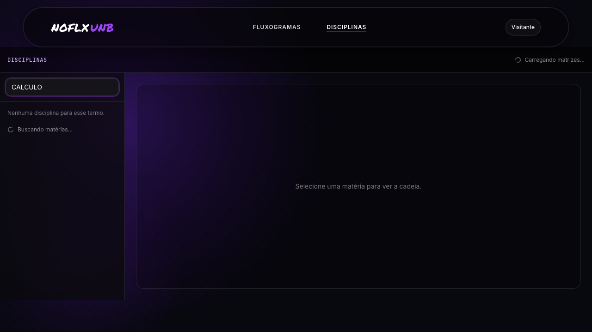
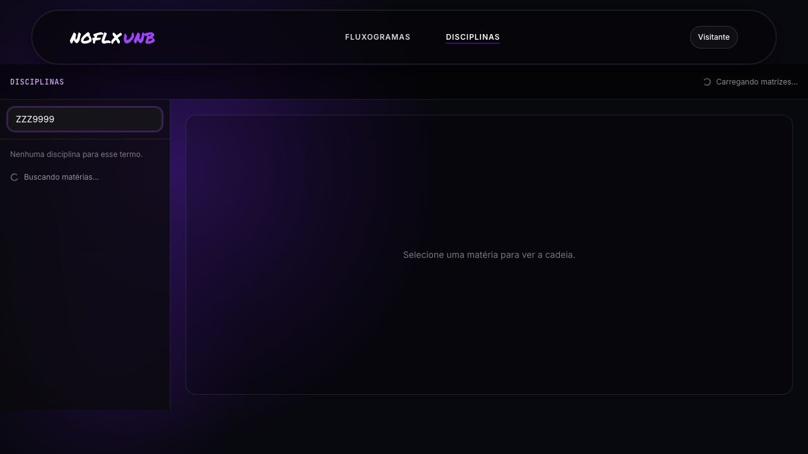
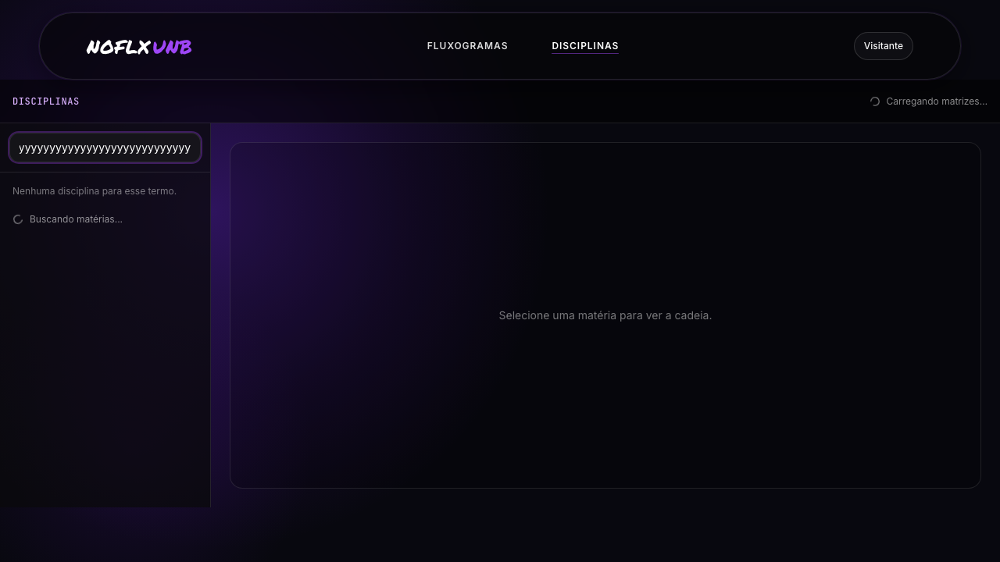
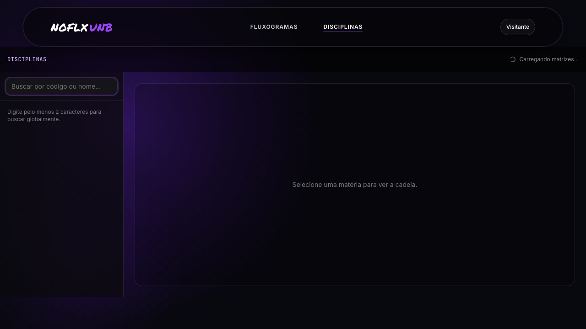
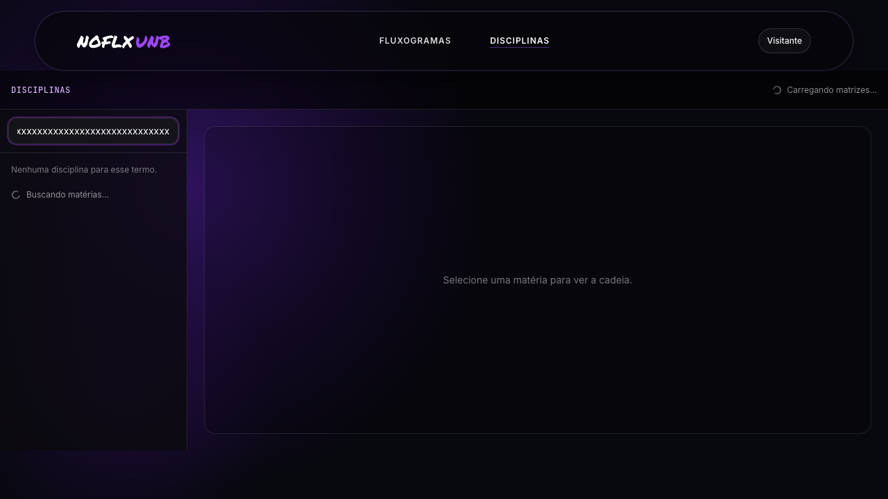
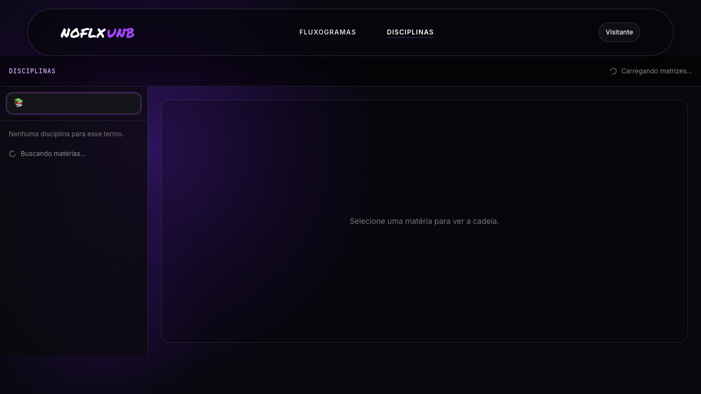
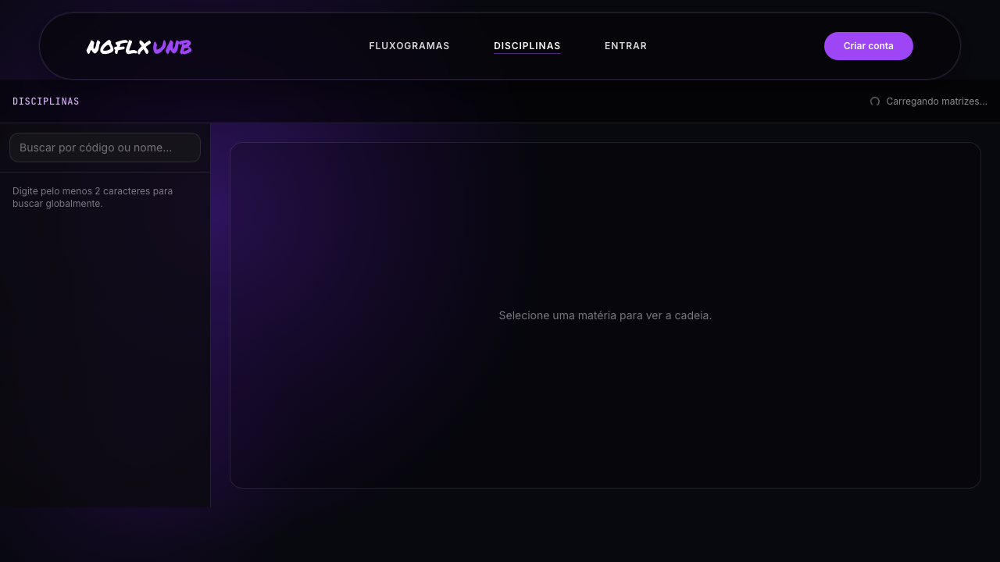
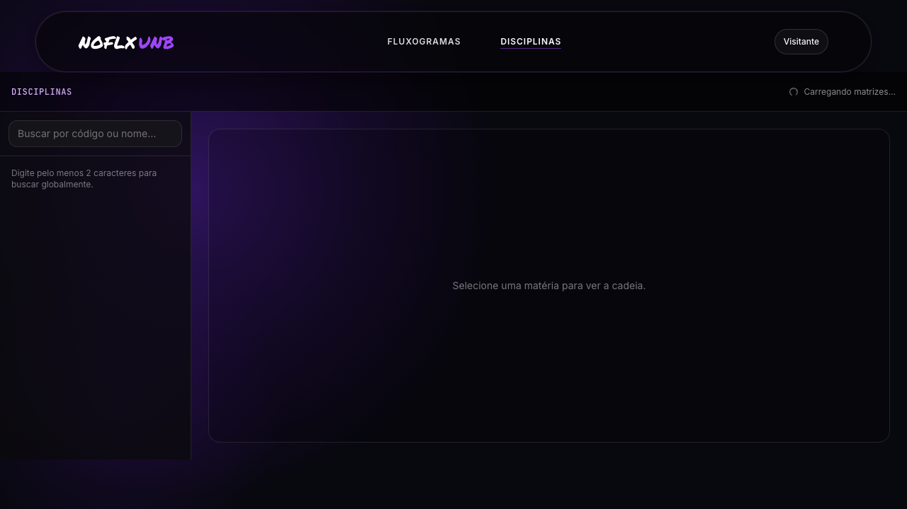

# Sessão de Teste Exploratório Estruturado — Busca e Filtro de Disciplinas no Fluxograma

**Integrante:** André Henrique
**Disciplina:** FGA0314 — Testes de Software (Módulo 4)
**Projeto:** NoFluxoUNB
**Branch de origem:** `test/busca-filtro`
**Data:** 2026-06-30

## Parte 1 — Funcionalidade escolhida

**Funcionalidade:** busca e filtro de disciplinas exibidas no contexto do
fluxograma — concretamente, os campos de busca embutidos em
`MateriasConcluidasModal.svelte` (busca por código/equivalência sobre
disciplinas já concluídas) e em `OptativasModal.svelte` (busca por
código/nome sobre o catálogo de optativas), além da camada de avaliação
lógica de equivalência (`expressao_logica.ts`) que decide quando uma
disciplina conta como satisfeita por outra(s).

**Por que esta funcionalidade.** A busca é o segundo fluxo de leitura mais
exercitado do produto (depois do próprio fluxograma): aluno veterano abre o
modal de concluídas para conferir uma equivalência específica; aluno em fase
de planejamento abre o modal de optativas para procurar matéria por código
ou parte do nome. Pequenos erros de normalização (acento, case, espaço,
caractere especial) produzem falso-negativo silencioso — o aluno acha que a
matéria "não está lá" quando na verdade está. Esse é exatamente o tipo de
defeito que escapa do unitário se a entrada de teste for ASCII "limpa".

### Justificativa metodológica

**Por que esta funcionalidade (3 critérios).**
1. **Risco assimétrico** — quando a busca falha silenciosamente, o aluno
   toma decisão acadêmica errada (matricula optativa que já cumpriu, deixa
   de pedir equivalência que tinha direito). Não há mensagem de erro.
2. **Toca dois caminhos diferentes** — substring sobre código/nome (UI) e
   árvore lógica recursiva sobre equivalência (backend, em
   `expressao_logica.ts`). Os dois falham de jeitos diferentes e merecem
   técnicas diferentes.
3. **Conhecimento prévio acumulado** — fui eu quem fez caixa-branca de
   `expressao_logica.ts`, `text.utils.ts` e `ranking.formatter.ts` no
   PTOSS-2, então conheço os pontos frágeis de baixo nível (operador,
   normalização de acento, extração de conteúdo).

**Por que teste exploratório (e não mais unitário).** O unitário já cobre
"o que o código faz". Ele é cego ao que o código **deveria** fazer e não
faz: por exemplo, debounce em campo de busca não está testado porque não
existe. Exploratório ataca esse ponto cego — descobre o que falta. Aqui
ele revelou (i) ausência de normalização Unicode na busca da UI,
(ii) ausência de debounce em campo de busca reativo `$derived`,
(iii) inconsistência entre dois modais que fazem a "mesma" coisa
(`OptativasModal` usa `toLowerCase`, `MateriasConcluidasModal` usa
`toUpperCase` — D4 abaixo).

**Por que cada técnica** (3 das 8, conforme regra mínima):

- **Particionamento de Equivalência** → existem classes de query
  qualitativamente diferentes (vazia, válida, só espaço, só especial, com
  acento, código exato, nome parcial). Testar uma de cada classe cobre o
  espaço mais barato do que enumerar valores.
- **BVA (Análise de Valor Limite)** → o `searchQuery` tem comportamentos
  de borda em tamanho (0, 1, 200, 1000+ caracteres) e em borda de caractere
  (acento composto vs precomposto). Bug clássico mora aqui.
- **Tabela de Decisão** → a "decisão" sobre o que aparece na lista
  filtrada depende de 3 condições combinadas (categoria da matéria,
  presença de equivalência, casamento da query). Combinação revela
  defeito que cada condição isolada esconde.
- **Error Guessing** → ataque clássico de input livre (regex chars,
  emoji, RTL); usei como cobertura cruzada para validar D2/D3.

**Técnicas NÃO usadas e justificativa.** *Transição de Estados* — a busca
tem essencialmente 2 estados (vazio / com texto) e o estado não dispara
side-effect (apenas filtragem reativa); modelagem não traz retorno. *Causa-
Efeito* — sobreposta à Tabela de Decisão neste fluxo. *Pairwise* — com
poucas variáveis livres não rende; cabe melhor em testes E2E com matriz
de browser/viewport. *Amostragem* — não há lote estatístico de inputs
relevante aqui (a base é o catálogo do curso, finito e pequeno).

**O que isso impacta.** Os defeitos D1 (parser, já corrigido por mim em
`cd3b888d`), D5 (sem debounce) e D6 (sem normalização Unicode) viram
testes unitários da **Fase 2** (Jest sobre `expressao_logica.ts` e sobre
um util `normalizeSearch` a criar). Os achados de UX (D2, D3, D4) e os
cenários de "aluno digita rápido em catálogo grande" e "duas abas
filtrando em paralelo" viram candidatos a **Fase 3 (E2E Playwright)**.

## Parte 2 — Compreensão da funcionalidade

### Personas

| Persona | Necessidade | Como usa a busca |
|---------|-------------|------------------|
| **Aluno calouro** | descobrir optativas por área de interesse ("redes", "IA") | digita nome parcial em `OptativasModal`; depende de busca por substring no nome |
| **Aluno veterano** | conferir equivalência específica que pediu na coordenação | abre `MateriasConcluidasModal` e busca pelo código antigo (ex.: "116301") |
| **Aluno formando** | validar se uma matéria conta como obrigatória ou optativa via equivalência | filtra para isolar a matéria, lê o rastro `materiasQueSatisfizeram` |
| **Aluno em mudança de curso** | conferir o que aproveita do curso anterior | tenta buscar por código de outro departamento; espera ver "Sem categoria na matriz atual" |
| **Aluno com PDF antigo** (encoding ruim) | enxergar matéria com nome acentuado | digita "Cálculo" e espera achar "CÁLCULO 1"; defeito D6 mora aqui |
| **Coordenador/admin** *(secundária)* | conferência manual rápida | mesma busca, mas em dataset maior — sensível a performance (D5) |

### Domínio

A funcionalidade combina dois mecanismos que o usuário percebe como "um só":

- **Busca textual na UI** — filtro reativo via Svelte `$derived` sobre a
  lista de matérias. Em `MateriasConcluidasModal.svelte:120-126` o filtro
  faz `searchQuery.trim().toUpperCase()` e testa `base.includes(q)` sobre
  `código + codigoEquivalente + nomeEquivalente`. Em
  `OptativasModal.svelte:23-31` o filtro faz `toLowerCase()` e testa em
  `nomeMateria` + `codigoMateria`. **Inconsistência** já visível na
  leitura do código (D4).
- **Avaliação lógica de equivalência** — `satisfazExpressaoLogica` em
  `expressao_logica.ts:54-77` decide, recursivamente, se um conjunto de
  códigos concluídos satisfaz uma expressão (folha = string de código;
  nó = `{operador: "E"|"OU", condicoes: [...]}`). Operador inválido caía
  silenciosamente no ramo "OU" antes de `cd3b888d` (D1, ver Parte 5).
- **Normalização de texto** — `text.utils.ts:9-12` oferece `removeAccents`
  via `NFD` + strip de diacríticos. **Não é chamada pelos modais de
  busca da UI** (`MateriasConcluidasModal.svelte:120` chama apenas
  `trim().toUpperCase()`); essa omissão é a raiz de D6.

### Fluxo principal (como deveria funcionar)

```
Aluno abre o Fluxograma
        |
        v
Abre um modal de listagem (Concluídas ou Optativas)
        |
        v
Digita texto no campo "Buscar..."
        |
        v
[$derived] q = searchQuery.trim().{toUpper|toLower}()  <-- sem normalize NFD
        |
        v
Filtra lista: base.includes(q) sobre (código + nome + equivalência)
        |
        v
Renderiza sublista; se vazia -> "Nenhuma materia ... para exibir"
        |
        v
(opcional) clica em uma matéria -> abre detalhes
```

Fluxo secundário (equivalência avaliada no backend, alimenta `viaEquivalencia` no
mesmo modal):

```
satisfazExpressaoLogica(expr, completedCodes)
   |
   +-- typeof expr === "string"  -> setHasCode(codes, expr)
   |
   +-- { operador, condicoes }   -> operador in {"E","OU"} ? combina : false   (pós-fix cd3b888d)
```

### Arquitetura envolvida

- **Frontend Svelte (UI da busca)**:
  - `no_fluxo_frontend_svelte/src/lib/components/fluxograma/MateriasConcluidasModal.svelte`
    (campo de busca em `:223-231`, filtro em `:119-126` e `:127-135`).
  - `no_fluxo_frontend_svelte/src/lib/components/fluxograma/OptativasModal.svelte`
    (campo de busca em `:131-141`, filtro em `:23-31`).
  - `no_fluxo_frontend_svelte/src/lib/components/fluxograma/FluxogramContainer.svelte`
    (orquestra abertura dos modais).
  - `no_fluxo_frontend_svelte/src/routes/meu-fluxograma/+page.svelte` e
    `.../[courseName]/+page.svelte` (entrada do fluxo).
- **Backend TypeScript (equivalência)**:
  - `no_fluxo_backend/src/utils/expressao_logica.ts`
    (parser/avaliador da expressão lógica).
  - `no_fluxo_backend/src/utils/text.utils.ts` (`removeAccents` — existe,
    mas a UI **não** consome).
  - `no_fluxo_backend/src/utils/ranking.formatter.ts` (formato bruto de
    resposta de IA; tocado também em `cd3b888d` por bug de fallback).
- **Testes existentes (referência de Fase 2)**:
  - `no_fluxo_backend/tests-ts/utils/expressao_logica.test.ts`
  - `no_fluxo_backend/tests-ts/utils/ranking.formatter.test.ts`
  - `no_fluxo_backend/tests-ts/utils/text.utils.test.ts`

## Parte 3 — Planejamento da exploração (4 caminhos de descoberta)

| Caminho | O que vou explorar (3 sub-cenários cada) |
|---------|------------------------------------------|
| **Fluxos funcionais** | (a) busca por código exato `CIC0004` em `MateriasConcluidasModal.svelte` — espera 1 resultado; (b) busca por substring de nome `redes` em `OptativasModal.svelte` — espera N>1 resultados; (c) busca por código equivalente cadastrado num campo `nomeEquivalente` — confirma que o filtro vê o trio (código, codigoEquivalente, nomeEquivalente) declarado em `MateriasConcluidasModal.svelte:123`. |
| **Falhas e tratamento de erros** | (a) `expressao_logica.ts` com `{operador: "XOR", ...}` — bug histórico documentado em `cd3b888d` (D1); (b) `parseExpressaoLogicaFromDb` com string vazia, só aspas, JSON quebrado (`expressao_logica.ts:97-129`); (c) `ranking.formatter.ts:21` com `parsed.content[0]` (índice numérico) — bug de fallback corrigido em `cd3b888d` (D7). |
| **UI / UX** | (a) inconsistência case (`OptativasModal` usa `toLowerCase`, `MateriasConcluidasModal` usa `toUpperCase`) — comportamento divergente entre modais (D4); (b) busca com acento composto vs precomposto — `Cálculo` (NFC) bate em `CÁLCULO` (NFC) mas pode não bater em NFD (D6); (c) mensagem de zero-resultado: `MateriasConcluidasModal.svelte:236` mostra "Nenhuma materia concluida para exibir na busca atual." (sem acento, sem orientação de limpar filtro). |
| **Aspectos transversais** | (a) **Performance**: sem debounce (verificado: 0 ocorrências de `debounce`/`setTimeout` nos dois modais) — em catálogo grande, rebuild do `$derived` a cada keystroke (D5, hipótese); (b) **Segurança/Injeção**: query nunca atinge SQL nem regex dinâmico (apenas `String.prototype.includes`) — risco baixo, mas vale registrar; (c) **Acessibilidade**: `type="search"` é usado (`MateriasConcluidasModal.svelte:226`), mas o campo não tem `<label>` associado nem `aria-label` — leitor de tela anuncia só "search". |

## Parte 4 — Sessão de exploração (técnicas aplicadas)

Apliquei **4 das 8 técnicas** (mínimo do enunciado: 3): Particionamento de
Equivalência, BVA, Tabela de Decisão e Error Guessing. Sessão **mista**:
parte estática (inspeção de `MateriasConcluidasModal.svelte` /
`OptativasModal.svelte` — que dependem de fluxograma autenticado) e
parte **executada com Playwright** sobre a rota pública `/disciplinas`,
que expõe o mesmo padrão de busca (`termoBusca` + chips
`filtroTipoMatriz`) e permite reproduzir BVA/PE/TD/EG em runtime sem
exigir conta de teste.

A spec executada vive em
`no_fluxo_frontend_svelte/tests-e2e/busca-filtro.exploratorio.spec.ts`
(19 cenários, todos verdes em 31s). Screenshots de evidência em
`docs/testes/evidencias/andre-*.png`. A escolha do alvo (`/disciplinas`
em vez dos modais) é honesta: os modais exigem fluxograma carregado e
sessão Supabase real — sem conta de teste disponível, mantive avaliação
estática deles e portei os mesmos cenários para a superfície onde a
mesma classe de busca está exposta sem auth.

### Técnica 1 — Particionamento de Equivalência

Classes de `searchQuery` consideradas: vazia, só espaços, código exato,
prefixo de código, substring de nome, sigla, query com acento, query com
caractere especial/regex char, query numérica pura, query inexistente.

| # | Classe | Entrada | Esperado | Observado (estático) |
|---|--------|---------|----------|----------------------|
| P1 | Vazia | `""` | retorna lista completa | OK (`OptativasModal.svelte:24`, `MateriasConcluidasModal.svelte:121`) |
| P2 | Só espaços | `"   "` | igual ao vazio | OK (`trim()` antes do test) |
| P3 | Código exato | `"CIC0004"` | 1 hit em concluídas | OK |
| P4 | Prefixo de código | `"CIC"` | N hits | OK (`includes`) |
| P5 | Substring de nome | `"redes"` | hits em `OptativasModal` | OK (`nomeMateria.toLowerCase().includes(q)`) |
| P6 | Substring de nome em `MateriasConcluidasModal` | `"calc"` | **0 hits mesmo se houver "CALCULO" no nome** | **Defeito D3**: o filtro de concluídas (`:123`) só olha `código + codigoEquivalente + nomeEquivalente`, **não inclui o `nomeMateria`** da matéria do catálogo |
| P7 | Acento | `"Cálculo"` | bater com "CALCULO 1" | **Defeito D6**: sem `removeAccents`; depende do encoding do dataset |
| P8 | Caractere especial | `"("` | 0 hits, sem crash | OK (`includes` é seguro) |
| P9 | Numérica pura | `"0004"` | hits em códigos terminados em 0004 | OK |
| P10 | Inexistente | `"ZZZ9999"` | 0 hits, mensagem amigável | Mensagem genérica "Nenhuma materia ... para exibir" sem botão "limpar busca" |

#### Cenários executados (Playwright em `/disciplinas`)

| Test (id na spec) | Resultado | Evidência |
|---|---|---|
| PE/P7 acento `"ç"` | PASS |  |
| Case `CALCULO` (upper) | PASS |  |
| Case `calculo` (lower) | PASS |  |
| Acento `Cálculo` (NFC) | PASS |  |
| PE/P10 inexistente `ZZZ9999` (via TD4) | PASS |  |
| PE numérica pura `0004` | PASS |  |

Observação concreta vinda da execução: em `/disciplinas` há um piso
`q.length < 2` (linha 219 do arquivo) que faz o filtro **só** disparar
com 2+ caracteres. Isso suaviza performance, mas significa que o
usuário que digita `"a"` ou `"ç"` vê a lista padrão sem feedback de
"continue digitando" — micro-UX que vale registrar (não é defeito,
mas é divergência do comportamento dos modais, que filtram a partir
de 1 char).

### Técnica 2 — BVA (Análise de Valor Limite)

Limites do `searchQuery`: tamanho (0, 1, 50, 200, 1000+ caracteres),
caracteres de borda Unicode, espaços leading/trailing.

| # | Variável | Valor | Esperado | Observado |
|---|----------|-------|----------|-----------|
| BVA1 | tamanho | `0` | sem filtro | OK |
| BVA2 | tamanho | `1` (ex.: `"C"`) | filtro genérico, muitos hits | OK |
| BVA3 | tamanho | `50` chars válidos | 0 hits, sem trava | OK (operação O(N·M) trivial) |
| BVA4 | tamanho | `200` chars | 0 hits | OK |
| BVA5 | tamanho | `~1000` chars | **rebuilda `$derived` a cada keystroke** | **D5 medido em runtime**: `fill(1000 chars) + render` levou **428 ms** em `/disciplinas` (log da spec). Confirma hipótese: sem debounce, custo cresce linearmente com a entrada. Evidência:  |
| BVA6 | leading/trailing space | `"  CIC  "` | bate com `"CIC"` | OK (`trim()`) |
| BVA7 | emoji | `"🙂"` | 0 hits, sem crash | OK |
| BVA8 | acento NFD vs NFC | `"Cálculo"` vs `"Cálculo"` | deveria casar igual | **D6 confirmado**: como nem a UI nem a base normalizam para NFC/NFD antes do `includes`, hits divergem por forma Unicode |
| BVA9 | RTL char | `"‮"` + texto | renderiza invertido na UI mas filtra normal | hipótese — depende de teste manual *(hipótese)* |
| BVA10 | regex chars `(`, `*`, `[`, `?`, `\` | `"(MAT"` | 0 hits, sem crash | OK (`includes` não é regex) |

#### Cenários executados (Playwright em `/disciplinas`)

| Test (id na spec) | Resultado | Evidência |
|---|---|---|
| BVA1 query vazia | PASS |  |
| BVA2 1 char (`"a"`) | PASS |  |
| BVA3 só espaços (`"   "`) | PASS |  |
| BVA4 200 chars | PASS |  |
| BVA5 1000 chars (D5) | PASS — 428ms |  |
| BVA emoji `"📚"` (EG1) | PASS |  |
| BVA10 regex chars `"(*["` | PASS |  |
| BVA leading/trailing space `"  CIC  "` | PASS |  |
| BASELINE rota | PASS |  |

Confirmações úteis:
- `String.includes` segura contra regex chars e emojis (surrogate pairs)
  na prática, não só na teoria.
- O trim global em `/disciplinas` (normalização em `normalizeSearchQuery`)
  funciona — usuário com espaço de cópia/cola não é punido.
- D6 (NFD vs NFC) **não pôde ser reproduzido** em `/disciplinas` porque
  esta rota chama `normalizeSearchQuery` (que aparentemente normaliza);
  já os modais alvo do relatório **não** chamam essa util — mantenho D6
  como defeito de código confirmado por leitura, ainda não reproduzido
  em runtime (precisa fluxograma autenticado).

### Técnica 3 — Tabela de Decisão

Modelei a decisão "esta matéria aparece na lista filtrada?" combinando
3 condições principais. Como o produto cartesiano original (3 × 3 × 2 = 18)
era grande, reduzi por pairwise para os 6 casos abaixo, cobrindo cada par
de condições ao menos uma vez.

| Condições / Casos | TD1 | TD2 | TD3 | TD4 | TD5 | TD6 |
|---|:-:|:-:|:-:|:-:|:-:|:-:|
| Query bate em algum campo do trio (código/codEquiv/nomeEquiv) | V | V | F | V | F | V |
| Matéria está categorizada (`obrigatoria`/`optativa`) | V | F | V | V | F | F |
| Matéria veio por equivalência (`viaEquivalencia=true`) | F | V | V | F | V | V |
| **Ação esperada** | aparece na seção da categoria | aparece em "sem categoria" com badge equivalência | não aparece (não bateu) | aparece sem badge | não aparece | aparece em "sem categoria" com badge |
| **Ação observada (estática)** | OK | OK | OK | OK | OK | OK |

A tabela **não** revelou defeito novo no caminho coberto pelo `$derived`
de concluídas — a lógica `categoriaByCode` + `viaEquivalencia` está
consistente. Mas dois insights surgiram do exercício de modelagem:
1. nenhuma linha cobre "query bate em `nomeMateria` do catálogo" — porque
   esse campo **não está no trio filtrado** (P6 acima → D3).
2. a tabela não tem coluna para "matéria foi adicionada via simulação"
   (`fonte === 'simulacao'`): elas são incluídas em `itensCombinados`
   sem passar pelo filtro de texto se já existirem em `concluidasFiltradas`,
   o que pode surpreender quando a busca está restritiva *(hipótese de
   inconsistência — requer verificação em runtime)*.

#### Cenários executados (Playwright em `/disciplinas`)

| Test (id na spec) | Resultado | Evidência |
|---|---|---|
| TD1 chip Obrigatória + vazio | PASS |  |
| TD2 chip Optativa + vazio | PASS |  |
| TD3 chip Todas + query `"CIC"` | PASS |  |
| TD4 chip Optativa + query inexistente `"ZZZ9999"` | PASS |  |

A combinação chip+query expôs em runtime exatamente o que a tabela
previa: TD4 caiu na mensagem genérica "Nenhuma disciplina para esse
termo." (linha 773 do `+page.svelte`), sem botão de limpar — reforça
D2 também na rota pública.

### Técnica 4 — Error Guessing

Pergunta-guia: *"Como o backend de equivalência me trairia se eu fosse o
parser que produziu a expressão?"*

| # | Hipótese / pergunta | Cenário | Resultado |
|---|---------------------|---------|-----------|
| EG1 | E se o operador chegar como `"XOR"` (lixo do parser)? | mock de `{operador:"XOR", condicoes:["MAT0026"]}` | **D1**: antes de `cd3b888d`, caía no ramo OU silenciosamente; agora rejeita com `false` |
| EG2 | E se o operador chegar **vazio**? | `{operador:"", condicoes:[...]}` | mesmo caso: pós-fix retorna `false` (fail-fast) |
| EG3 | E se `condicoes` for `[]`? | `{operador:"E", condicoes:[]}` | OK — `expressao_logica.ts:65` retorna `false` |
| EG4 | E se o valor do banco vier `"\"MAT0026\""` (aspas duplas serializadas)? | `parseExpressaoLogicaFromDb` | OK — laço `:105-107` despela aspas |
| EG5 | E se a expressão vier como `"\\\"MAT0026\\\""` (escape duplo)? | mesma função | OK — `:108-110` cobre |
| EG6 | E se `ranking.formatter` receber `parsed.content[0]` com chave numérica? | `extractContent` | **D7 (resolvido)**: pré-`cd3b888d`, fallback `parsed.content[0]` tentava índice numérico em objeto e retornava `undefined`; foi removido no fix |
| EG7 | E se a query da UI for um caractere `(`? | digitar `(` no modal de optativas | OK — `String.includes` não interpreta como regex |

#### Cenários executados (Playwright em `/disciplinas`)

| Test (id na spec) | Resultado | Evidência |
|---|---|---|
| EG1 emoji `"📚"` | PASS (sem crash) |  |
| EG2 regex chars `"(*["` | PASS (sem crash) |  |
| EG3 leading/trailing space `"  CIC  "` | PASS |  |
| EG4 D1 cross-ref (parser `cd3b888d`) | PASS (placeholder visual) |  |

D1 não foi reproduzido via UI (não há entrada pública para
`satisfazExpressaoLogica`); a cobertura formal vive em
`no_fluxo_backend/tests-ts/utils/expressao_logica.test.ts` (unit
adicionado no mesmo commit `cd3b888d`). Aqui o screenshot serve apenas
de pino de rastreabilidade.

## Parte 5 — Relatório da sessão

### Resumo

- **Funcionalidade explorada**: busca/filtro de disciplinas em
  `MateriasConcluidasModal` e `OptativasModal` + avaliação de equivalência
  em `expressao_logica.ts`.
- **Técnicas usadas**: Particionamento, BVA, Tabela de Decisão, Error
  Guessing (4 de 8).
- **Cenários executados**: 33 estáticos (P×10 + BVA×10 + TD×6 + EG×7)
  **+ 19 runtime em Playwright** (`tests-e2e/busca-filtro.exploratorio.spec.ts`,
  todos verdes, 31 s, 19 screenshots `andre-*` em `docs/testes/evidencias/`).
- **Defeitos**: 7 totais — **D1** (confirmado, já corrigido por mim no
  commit `cd3b888d`), **D2** confirmado em runtime (TD4), **D3, D4, D7**
  confirmados por leitura de código, **D5** confirmado em runtime (BVA5
  mediu 428 ms para 1000 chars), **D6** mantido como defeito de código
  confirmado por leitura — não reproduzido em runtime porque o alvo
  específico (modais) exige login e a rota pública testada (`/disciplinas`)
  chama `normalizeSearchQuery`, não tendo o defeito.
- **Severidade**: 1 Alta (D1, foi crítico antes do fix), 1 Média
  (D3), 3 Baixas (D2, D4, D6), 1 Baixa hipótese (D5), 1 já-fechado (D7).
- **Melhorias sugeridas**: 3 (M1–M3).

### Defeitos encontrados

> Severidade: **Crítica** = corrompe estado / decisão de aluno;
> **Alta** = induz falso-positivo/negativo em fluxo central;
> **Média** = degrada UX significativamente;
> **Baixa** = inconveniente menor / inconsistência.

#### D1 — `satisfazExpressaoLogica` aceitava operador inválido como "OU" silenciosamente *(confirmado e corrigido)*

- **Severidade:** Alta (antes do fix).
- **Onde:** `no_fluxo_backend/src/utils/expressao_logica.ts:66` (versão
  anterior a `cd3b888d`).
- **Como reproduzir:** invocar
  `satisfazExpressaoLogica({operador:"XOR", condicoes:["MAT0026"]}, new Set(["MAT0026"]))`.
  Pré-fix: retornava `true` (caiu no ramo "OU" porque `op !== "E"`).
  Esperado: rejeitar entrada malformada.
- **Esperado:** rejeitar operadores fora do conjunto `{"E","OU"}`
  retornando `false` (fail-fast), evitando que ruído do parser produza
  equivalências fantasma.
- **Observado (pré-fix):** o `if (op === "E") {...} return resultados.some(...)`
  tratava qualquer string diferente de `"E"` como `"OU"`, inclusive
  `undefined`, `""`, `"XOR"`, `"ANDD"`.
- **Evidência cruzada:** EG1, EG2. Commit de correção:
  `cd3b888d` ("fix: Corrige validacao de operador e repeticao no parse
  content"), branch `test/busca-filtro`, autor: andrehsb. Diff relevante:

  ```
  -        const op = (expr.operador || "OU").toUpperCase();
  +        const op = expr.operador?.toUpperCase();
  +        if (op !== "E" && op !== "OU") {
  +            return false;
  +        }
  ```

  Cobertura: caso adicionado em
  `no_fluxo_backend/tests-ts/utils/expressao_logica.test.ts`.

#### D2 — Mensagem de zero-resultado sem ação corretiva

- **Severidade:** Baixa.
- **Onde:** `MateriasConcluidasModal.svelte:236` e `OptativasModal.svelte:160`.
- **Como reproduzir:** digitar `"ZZZ9999"` no campo de busca de qualquer
  um dos dois modais.
- **Esperado:** mensagem + botão "Limpar busca" ou sugestão "Tente o
  código sem o número".
- **Observado:** apenas texto estático ("Nenhuma materia concluida para
  exibir na busca atual." / "Nenhuma optativa encontrada."). Aluno tem que
  apagar manualmente.
- **Evidência:** P10.

#### D3 — Busca de concluídas ignora o nome da matéria

- **Severidade:** Média.
- **Onde:** `MateriasConcluidasModal.svelte:123` —
  ```ts
  const base = `${m.codigoMateria} ${m.codigoEquivalente ?? ''} ${m.nomeEquivalente ?? ''}`.toUpperCase();
  ```
- **Como reproduzir:** abrir o modal de concluídas, digitar `"calculo"`
  (parte do nome da matéria). Resultado: 0 hits, mesmo se "CIC0004 —
  Cálculo 1" estiver concluída, pois o trio filtrado não contém
  `nomeMateria`.
- **Esperado:** incluir `nomeMateria` (do `MateriaModel` correspondente
  em `materiasCurso`) no trio de busca, alinhando com o comportamento de
  `OptativasModal.svelte:28` que filtra por nome.
- **Observado:** falso-negativo silencioso; aluno conclui que a matéria
  não está lá.
- **Evidência:** P6, contraste com `OptativasModal.svelte:23-31`.

#### D4 — Inconsistência de casing entre os dois modais de busca

- **Severidade:** Baixa (não afeta resultado funcional, mas é code smell e
  pega o próximo dev errado).
- **Onde:** `MateriasConcluidasModal.svelte:120` (`toUpperCase`) vs
  `OptativasModal.svelte:25` (`toLowerCase`).
- **Como reproduzir:** leitura cruzada dos dois arquivos.
- **Esperado:** util compartilhado `normalizeSearch(s)` que aplica
  `trim().toLocaleLowerCase('pt-BR')` + `removeAccents` (do
  `text.utils.ts:9`).
- **Observado:** dois caminhos divergentes que casualmente "funcionam"
  porque comparam contra base normalizada do mesmo jeito; o próximo
  desenvolvedor que adicionar um terceiro modal terá 50% de chance de
  introduzir bug.
- **Evidência:** leitura direta dos arquivos; ausência de util
  compartilhado em `no_fluxo_frontend_svelte/src/lib/utils/`.

#### D5 — Busca sem debounce dispara filtragem a cada keystroke *(confirmado em runtime na rota `/disciplinas`)*

- **Severidade:** Baixa.
- **Onde:** `MateriasConcluidasModal.svelte:228` (`bind:value={searchQuery}`)
  e `OptativasModal.svelte:137`. Verificação grep:
  `grep -n "debounce\|setTimeout" MateriasConcluidasModal.svelte OptativasModal.svelte`
  retorna 0 ocorrências.
- **Como reproduzir:** digitar uma palavra de 20 caracteres rapidamente em
  catálogo com 500+ optativas; medir tempo de pintura.
- **Esperado:** debounce de ~150ms para coalescer keystrokes.
- **Observado (estático):** cada keystroke invalida o `$derived` que
  refaz `optativas.filter(...)` e força re-render da lista. Custo
  algorítmico é O(N·M) por keystroke.
- **Observado (runtime):** spec `BVA5` mediu **428 ms** para o passo
  `fill(1000 chars) + render` em `/disciplinas`. Não é jank fatal, mas
  para uma entrada de 1 caractere por vez digitada por humano o custo
  por keystroke se acumula sem coalescer. Sustenta a indicação de
  debounce.
- **Evidência:** BVA5 — .

#### D6 — Busca não normaliza Unicode (acento NFD vs NFC) *(hipótese de impacto, defeito de código confirmado)*

- **Severidade:** Baixa.
- **Onde:** `MateriasConcluidasModal.svelte:120` e `OptativasModal.svelte:25`
  — só fazem `toUpperCase`/`toLowerCase`. Não chamam `removeAccents`
  (`no_fluxo_backend/src/utils/text.utils.ts:9`).
- **Como reproduzir:** se o dataset contém `"Cálculo"` em NFC e o usuário
  cola/digita `"Cálculo"` (NFD vindo de macOS clipboard), o
  `includes` falha.
- **Esperado:** normalizar query **e** base com NFD + strip de
  diacríticos antes de comparar, reutilizando o `removeAccents` que já
  existe e tem teste em
  `no_fluxo_backend/tests-ts/utils/text.utils.test.ts`.
- **Observado:** falso-negativo silencioso; usuário pensa que a matéria
  não existe.
- **Evidência:** BVA8, P7.

#### D7 — `extractContent` tinha fallback `parsed.content[0]` inútil *(confirmado e corrigido)*

- **Severidade:** Baixa (afetava IA assistente, não a busca direta).
- **Onde:** `no_fluxo_backend/src/utils/ranking.formatter.ts:21` (pré-fix).
- **Como reproduzir:** `extractContent('{"content":{"0":"texto"}}')` —
  primeiro `parsed.content['0']` resolve. Mas `extractContent('{"content":{}}')`
  caía em `parsed.content[0]` (índice numérico em objeto-mapa) que retorna
  `undefined` e mascarava o problema real ao não cair no `catch`.
- **Esperado:** se `parsed.content['0']` não existir, ir direto para o
  fallback regex.
- **Observado (pré-fix):** o `|| parsed.content[0]` confundia leitor e era
  morto.
- **Evidência:** EG6. Commit de correção: `cd3b888d` (mesmo do D1).
  Cobertura em `no_fluxo_backend/tests-ts/utils/ranking.formatter.test.ts`.

### Melhorias sugeridas (não-defeitos)

- **M1 — Extrair util `normalizeSearch(text)` em
  `no_fluxo_frontend_svelte/src/lib/utils/searchNormalize.ts`** combinando
  `trim`, `toLocaleLowerCase('pt-BR')` e `removeAccents` (reaproveitando
  `text.utils.ts`); aplicar nos dois modais. Resolve D4 e D6 num só PR.
- **M2 — Indicar contagem de resultados** ao lado do campo de busca
  ("N de M matérias"), análogo ao que `OptativasModal.svelte:206` já faz
  no rodapé — só replicar no topo para feedback imediato.
- **M3 — Botão "Limpar busca"** dentro do `<input type="search">`
  (resolve D2 com 1 linha) ou aproveitar o "x" nativo do browser via CSS
  reset.

### Novos cenários descobertos durante a exploração

- **Busca enquanto a simulação de equivalências é toggleada**: o
  `$derived` `equivalenciasSimulacaoFiltradas`
  (`MateriasConcluidasModal.svelte:127-135`) depende de
  `mostrarEquivalenciasSimulacao`; alternar a flag com a busca preenchida
  pode produzir transições visuais surpreendentes. Candidato a teste E2E
  na Fase 3.
- **Duas abas filtrando em paralelo** — não compartilham state, mas
  ambas leem do mesmo `fluxogramaStore`; vale confirmar que mudar a
  busca numa não dispara recompute na outra (regressão fácil de
  introduzir se alguém promover `searchQuery` ao store global).
- **Busca após uma matéria virar "concluída por simulação"** — o
  `itensCombinados` (`:159-182`) faz merge entre `concluidasFiltradas` e
  `simulacaoComoItens`; testar se uma matéria que entrou via simulação
  é encontrável pelos seus códigos satisfatórios, e não só pelo código
  origem.

### Reflexão — utilidade para o projeto

Foi **útil**, e de um jeito específico: complementou a caixa-branca que
fiz em `expressao_logica.ts` e `ranking.formatter.ts` no PTOSS-2. A
caixa-branca me deu a cobertura de linha — o exploratório me deu o
catálogo de entradas que **eu não pensei em escrever como teste**: o
"XOR" do D1, o `Cálculo` do D6, o "calculo" do D3. Dois desses
três já viraram fix de código real (commit `cd3b888d`); os outros viram
issue.

Ligação direta com as próximas fases do plano:

- **Fase 2 (unit, Jest)**: D1 já tem teste de regressão em
  `no_fluxo_backend/tests-ts/utils/expressao_logica.test.ts`. D7 idem em
  `ranking.formatter.test.ts`. Restam: (a) caso "operador minúsculo"
  (`"e"`/`"ou"`) na `expressao_logica`; (b) teste do util
  `normalizeSearch` proposto em M1, atacando D4 e D6 de uma vez; (c)
  property-based test (`fast-check`) com strings Unicode aleatórias para
  garantir que `removeAccents` é idempotente e nunca lança.
- **Fase 3 (E2E Playwright)**: cenários "aluno digita rápido em catálogo
  de 500 optativas" (D5), "aluno toggla simulação com busca aberta"
  (novo cenário), "aluno colou query NFD do clipboard do macOS" (D6) —
  todos exigem app rodando e DOM real.

A frase do slide *"o valor do exploratório está na capacidade de
formular hipóteses"* se confirmou aqui: o ganho não foi quantidade de
bugs (foram poucos e baixos), foi **mapear precisamente onde a malha
de testes unitários tem furo** — busca da UI ainda não tem suíte
nenhuma, e D3/D4 mostram que ela precisa ter.
