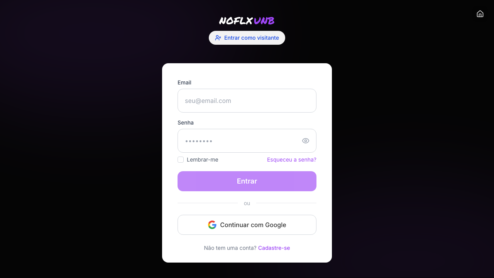
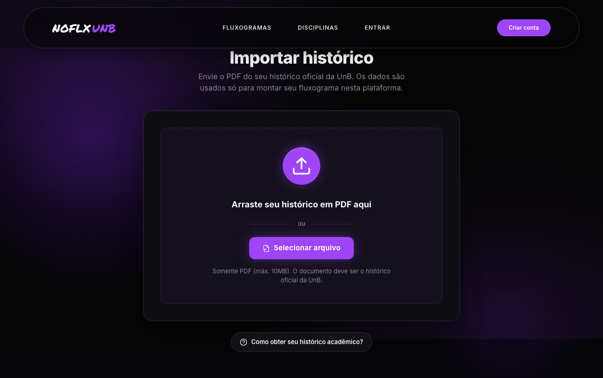
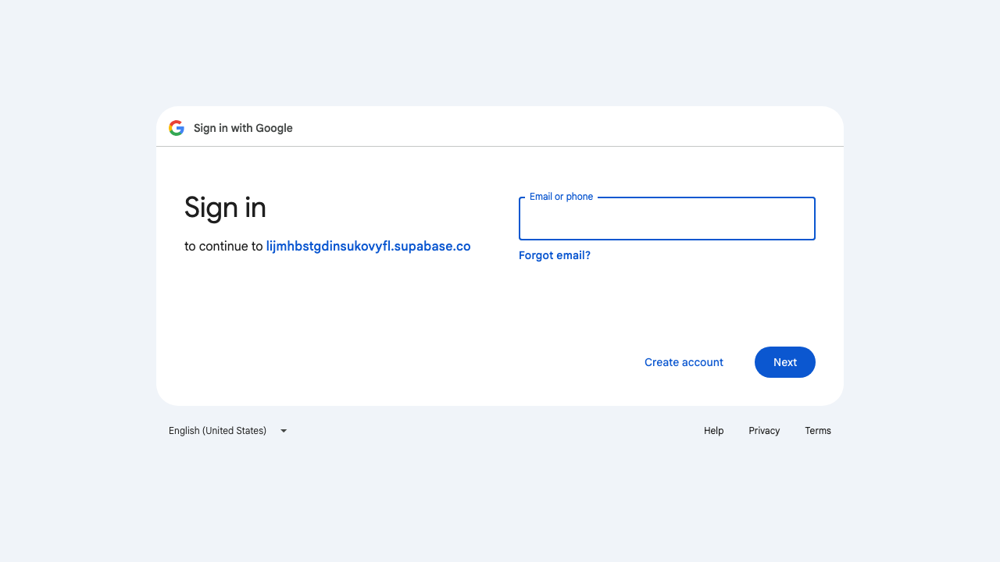

# Sessão de Teste Exploratório Estruturado — Login / Autenticação (Google OAuth + Supabase)

**Integrante:** Vinícius (Vini) — PTOSS-2
**Disciplina:** FGA0314 — Testes de Software (Módulo 4)
**Projeto:** NoFluxoUNB
**Branch:** `feat/testes/exercicio-teste-exploratorio`
**Data:** 2026-06-30

## Parte 1 — Funcionalidade escolhida

**Funcionalidade:** autenticação completa do NoFluxoUNB — login por e-mail/senha,
login Google (OAuth com PKCE), modo anônimo, cadastro, recuperação/redefinição
de senha e o guard de rotas que decide quem entra onde.

**Por que esta funcionalidade.** Login é o **portão** do produto. Se quebra,
nada do resto (upload de histórico, fluxograma, dashboards) é alcançável.
Atravessa Svelte (UI) → `authService` (singleton) → `authStore` (persistência
em `localStorage`) → Supabase Auth (OAuth/PKCE, JWT) → Postgres + RLS. Ou seja,
toca todas as camadas do *Full Stack Testing* e é exatamente o tipo de
superfície que o slide *"caminhos transversais"* destaca como crítica.

### Justificativa metodológica

**Por que esta funcionalidade (e não outra do meu escopo).** Três motivos
somados: (1) **risco** — defeitos de auth são de impacto desproporcional (vazam
dados de aluno, derrubam todo mundo, e raramente são pegos por unit tests
porque vivem em transições assíncronas e em integração com terceiros);
(2) **acoplamento alto com terceiros** — depende do Supabase, do Google OAuth e
de cookies/localStorage do browser, o que multiplica modos de falha que
caixa-branca não enxerga; (3) **valor para o time** — a Fase 2 (unit) já
planejada do PTOSS-2 não cobre fluxo OAuth nem PKCE; descobrir riscos aqui
guia onde investir esforço de E2E na Fase 3.

**Por que exploratório (e não mais unitário).** O `authService` é testável em
unidade (mockando `supabase.auth`), e isso será feito na Fase 2. Mas o que
realmente dói em auth são os **buracos entre os componentes**: o PKCE
`code_verifier` armazenado pelo cliente que iniciou o OAuth e ausente no
cliente que recebe o callback; o cookie `nofluxo_anonimo` que sobrevive a um
login subsequente; o `localStorage` corrompido (`"undefined"` literal) que
quebra a inicialização do store. Isso é **integração** e **estado** — terreno
nativo do exploratório.

**Por que cada técnica** (3 das 8, escolhidas pelo formato do risco):

- **Transição de Estados** — é o *exemplo clássico* do slide, e a auth tem
  estados explícitos e modeláveis (`NotLoggedIn`, `Authenticating`, `LoggedIn`,
  `SessionExpired`, `Error`, mais o estado paralelo `Anonymous`). Defeitos de
  consistência de sessão moram nas setas inesperadas (anônimo → logado sem
  limpar cookie; recovery → logged-in sem signOut).
- **Tabela de Decisão** — o `authGuard.ts` combina ≥4 condições simultâneas
  (sessão? token válido? rota pública? rota requer escopo admin?). Testar uma
  variável de cada vez perde combinações; tabela revela TC2 e TC4 abaixo.
- **Error Guessing** — auth é a superfície de ataque clássica do usuário
  hostil/distraído (popup cancelado, refresh em aba errada, deep-link
  deslogado, dois dispositivos). Rendeu D1, D2, D5.

**Por que NÃO usei as outras 5.** *BVA* não é o gargalo (o único limite
numérico relevante é "senha ≥ 6 caracteres" — fix trivial, registrei como D6).
*Pairwise* brilha com muitas variáveis independentes (configs, browsers); aqui
o `authGuard` tem só 4 condições e Tabela de Decisão já cobre. *Amostragem
estatística* não cabe num fluxo discreto. *Causa-Efeito* se sobrepõe à Tabela
de Decisão. *Particionamento* dos inputs (email válido/inválido, senha curta/
longa) virou item de unit test na Fase 2, não compensa investir aqui.

**Impacto nas próximas fases.** Cada defeito alimenta a Fase 2 (unit em
`authService.isSessionValid`, `authGuard.checkAuth`, `authStore.clear`) e a
Fase 3 (E2E Playwright: fluxo Google completo com PKCE; deep-link deslogado;
recovery link expirado; cookie órfão pós-anônimo).

## Parte 2 — Compreensão da funcionalidade

### Personas

| Persona | Necessidade | Como interage com auth |
|---------|-------------|------------------------|
| **Calouro Google** | criar conta sem fricção usando e-mail @aluno.unb.br do Google Workspace | clica "Entrar com Google", primeiro login → `databaseSearchUser` falha → `databaseRegisterUser` cria linha em `users`. Sensível a race conditions de primeiro login (PKCE, dois clientes). |
| **Veterano e-mail/senha** | login recorrente rápido, sem 2FA | `signInWithPassword`, espera sessão persistente entre dias; sensível a `expires_at` e refresh silencioso. |
| **Visitante anônimo** | explorar fluxograma público sem cadastrar | clica "Entrar como visitante" → `authStore.setAnonymous(true)` → grava cookie e flag em localStorage. Pode depois decidir criar conta — fluxo de "upgrade" precisa limpar estado anônimo. |
| **Admin com escopo** | acessar `/admin/*` específico do escopo (ex.: `admin:dashboards`) | `enrichWithAdmin` via RPC `get_my_admin`; `authGuard` checa `hasAdminScope` antes de liberar. |
| **Esqueceu a senha** | redefinir senha por e-mail | clica "Esqueci a senha" → `sendPasswordResetEmail` → recebe link com `token_hash&type=recovery` → `/auth/reset-password` valida e abre form de nova senha. Sensível a link expirado/reusado. |

### Domínio

A autenticação do NoFluxoUNB combina **Supabase Auth** (provedor de identidade,
JWT, refresh tokens, PKCE para OAuth) com uma tabela `public.users` própria
que relaciona o `auth.uid()` do Supabase ao `id_user` interno usado no resto do
schema. Conceitos principais:

- **Sessão Supabase** (`auth.service.ts:359-364`): `{ access_token,
  refresh_token, expires_at, user }` persistida pelo cliente em `localStorage`
  com chave `sb-<project-ref>-auth-token` (configurada pelo SDK).
- **Snapshot interno** (`stores/auth.ts:6-7`): `nofluxo_user` em
  `localStorage` (JSON do `UserModel`) e `nofluxo_anonimo` em `localStorage`
  + cookie homônimo para SSR/middleware.
- **Estado anônimo** (`stores/auth.ts:93-110`): paralelo ao autenticado, mas
  mutuamente exclusivo no store (`setUser` zera `isAnonymous`; `setAnonymous`
  zera `user`).
- **Validade da sessão** (`auth.service.ts:379-393`): `isSessionValid()`
  compara `expires_at` (em segundos Unix) com `Date.now()`; se expirada chama
  `signOut()` e retorna `false`. **Se `expires_at` for `undefined`, a sessão é
  considerada válida sem checagem** — ver hipótese em D3.
- **Guard** (`guards/authGuard.ts:25-73`): única camada de proteção (sem
  `hooks.server.ts`); 100% client-side. Combina listas `PUBLIC_ROUTES_EXACT`
  (10 entradas, linha 9-20) e `PUBLIC_ROUTES_PREFIX` (3 entradas, linha 23).
- **OAuth + PKCE** (`auth.service.ts:225-241` e `:247-278`): o
  `signInWithOAuth` salva o `code_verifier` no `localStorage` da aba que
  iniciou; `exchangeCodeForSessionAndHandleCallback` no `/auth/callback` lê
  esse verifier para trocar pelo `access_token`. Se aba de origem ≠ aba de
  callback, o verifier some → erro tratado em `:255-258` com fallback para
  `handleOAuthCallback()` (que tenta `getSession` direto).
- **Recovery**: link de e-mail vem como `?token_hash=...&type=recovery`,
  validado em `verifyOtp({ type: 'recovery', token_hash })`
  (`auth.service.ts:458-469`). Após validar, o Supabase cria uma sessão
  *temporária*; o `updatePassword` opera sobre essa sessão e logo em seguida
  `signOut()` força o usuário a logar com a nova senha
  (`reset-password/+page.svelte:67-73`).

### Fluxo principal (Google OAuth happy path)

```
Aluno em /login (não autenticado)
        ↓ clica "Entrar com Google"
authService.signInWithGoogle(redirectTo='/auth/callback')
        ↓ Supabase salva code_verifier em localStorage (PKCE)
Redireciona para accounts.google.com (prompt=consent)
        ↓ aluno consente
Google redireciona para /auth/callback?code=AUTH_CODE
        ↓ onMount lê 'code'
authService.exchangeCodeForSessionAndHandleCallback(code)
        ↓ supabase.auth.exchangeCodeForSession(code) usa code_verifier salvo
Recebe Session {access_token, refresh_token, expires_at, user}
        ↓ handleOAuthCallback(session) lê email/displayName
databaseSearchUser()  ────→ se achou: authStore.setUser, FIM
        ↓ se não achou (novo usuário)
databaseRegisterUser(email, displayName)
        ↓ INSERT em public.users com auth_id = session.user.id
authStore.setUser(user)  → localStorage.nofluxo_user
        ↓
goto('/upload-historico')  (ou ?next=...)
```

### Arquitetura envolvida

- **Service singleton**:
  `no_fluxo_frontend_svelte/src/lib/services/auth.service.ts` (490 linhas, todas
  as operações de auth passam por aqui).
- **Store reativo**:
  `no_fluxo_frontend_svelte/src/lib/stores/auth.ts` (`createAuthStore`,
  persistência em `localStorage` chaves `nofluxo_user` e `nofluxo_anonimo`,
  derived stores `currentUser`, `isAuthenticated`, `isAnonymous`).
- **Guard client-side**:
  `no_fluxo_frontend_svelte/src/lib/guards/authGuard.ts` (`checkAuth`,
  `checkAlreadyAuthenticated`, listas públicas).
- **Rotas**:
  `src/routes/login/+page.svelte`, `src/routes/signup/+page.svelte`,
  `src/routes/login-anonimo/+page.svelte`,
  `src/routes/password-recovery/+page.svelte`,
  `src/routes/auth/callback/+page.svelte`,
  `src/routes/auth/reset-password/+page.svelte`.
- **Cliente Supabase**:
  `no_fluxo_frontend_svelte/src/lib/supabase/client.ts`
  (`createSupabaseBrowserClient`).
- **Mapeamento de erros**:
  `no_fluxo_frontend_svelte/src/lib/types/errors.ts` (`parseAuthError`).
- **Doc de referência**: `no_fluxo_frontend_svelte/SUPABASE_AUTH.md`.

## Parte 3 — Planejamento da exploração (4 caminhos de descoberta)

| Caminho | Sub-cenário 1 | Sub-cenário 2 | Sub-cenário 3 |
|---------|---------------|---------------|----------------|
| **Fluxos funcionais** | login Google primeiro acesso (cria linha em `users` via `databaseRegisterUser` em `auth.service.ts:73-116`) | login e-mail/senha recorrente (`signIn` em `auth.service.ts:175-220`, espera `localStorage.nofluxo_user` restaurar sessão na próxima visita via `getInitialState` em `stores/auth.ts:10-65`) | login anônimo seguido de upgrade para conta real (`login-anonimo/+page.svelte` → depois `/login` ou `/signup`; precisa limpar cookie `nofluxo_anonimo` em `stores/auth.ts:154-168`) |
| **Falhas e tratamento de erros** | callback OAuth sem `code` e sem sessão (`auth/callback/+page.svelte:42-56` → cai em `handleOAuthCallback()` que chama `getUser`) | PKCE `code_verifier` ausente porque login iniciou em outra aba (`auth.service.ts:255-258` tem fallback, mas mensagem ao usuário é genérica) | link de recovery expirado/reusado (`auth/reset-password/+page.svelte:25-33` chama `verifyRecoveryToken`; sem rate-limit visível) |
| **UI / UX** | botão "Entrar com Google" sem `loading` enquanto redireciona (verificar `LoginForm.svelte`) | mensagem "Usuário autenticado, mas não encontrado no banco de dados interno" (`auth.service.ts:203-209`) — termo "banco de dados interno" assusta usuário final | tela `/auth/callback` mostra `error` cru do Supabase (`auth/callback/+page.svelte:29,38,53`) sem traduzir |
| **Aspectos transversais** | **Segurança**: rota `/auth/reset-password` aceita `token_hash` da query sem rate-limit aparente → brute force teórico (`auth/reset-password/+page.svelte:22-32`) | **Privacidade**: `localStorage.nofluxo_user` guarda `email`, `nomeCompleto` e `token JWT` em texto puro (`stores/auth.ts:76`); qualquer XSS no domínio rouba sessão completa | **Performance/custo**: `getAuthHeaders` chama `refreshSession` em **toda** request autenticada (`auth.service.ts:419-428`) — onera Supabase e pode causar loop se token vier inválido |

## Parte 4 — Sessão de exploração (técnicas aplicadas)

Apliquei **3 das 8 técnicas** (slide pedia ao menos 3): Transição de Estados,
Tabela de Decisão e Error Guessing. As 5 restantes (BVA, Pairwise,
Causa-Efeito, Amostragem, Particionamento) foram analisadas e descartadas com
justificativa na Parte 1. Total de cenários: **22** (TE×7 + TC×8 + EG×7).

> **Execução automatizada (Playwright):** a análise estática original foi
> complementada por uma suite E2E em
> `no_fluxo_frontend_svelte/tests-e2e/login-auth.exploratorio.spec.ts`
> (14 cenários, **14/14 PASS**, evidências em `evidencias/vini-*.png`). Onde
> apropriado, cada técnica abaixo agora referencia o screenshot real; quando
> o cenário não pôde ser exercitado em runtime (depende de usuário Supabase
> real, mock de `expires_at`, ou XSS efetivo), o item segue marcado como
> *hipótese* com a razão explícita.

### Técnica 1 — Transição de Estados

Modelei a máquina de estados implícita do par `authStore` + `authService`. O
diagrama abaixo é o **exemplo-âncora do slide** aplicado à auth:

```
                            ┌──────────────────────────────┐
                            │        NotLoggedIn           │◄─────────────┐
                            │  (isAuth=F, isAnon=F)        │              │
                            └───┬──────────┬───────┬───────┘              │
              clica Google      │          │       │  clica "Visitante"   │
              ou submit form    │          │       │                       │
                                ▼          │       ▼                       │
            ┌────────────────────────┐     │  ┌──────────────────┐         │
            │  Authenticating(Email) │     │  │    Anonymous     │         │
            │  setLoading(true)      │     │  │ (isAuth=F        │         │
            └─────┬──────────┬───────┘     │  │  isAnon=T)       │         │
                  │ ok       │ erro        │  └──────┬───────────┘         │
                  ▼          ▼             │         │ clica "Entrar"      │
              ┌──────────────────┐         │         │ (sem signOut)       │
              │   LoggedIn       │◄────────┘         ▼                     │
              │ (isAuth=T,       │         (fluxo Google/email)            │
              │  isAnon=F,       │                                          │
              │  token, user)    │                                          │
              └──┬───────┬───────┘                                          │
   expires_at < │       │ signOut()                                        │
   Date.now()  ▼        ▼                                                  │
      ┌─────────────┐  ┌──────────────────────────────────────────┐        │
      │SessionExpired│ │  Recovering (token_hash + type=recovery) │        │
      │(isValid→F)  │ │  verifyRecoveryToken → sessão temporária  │        │
      └──┬──────────┘ └────────┬─────────────────────────────────┘         │
         │                     │  updatePassword                            │
         │                     ▼                                            │
         │           ┌───────────────────────┐                              │
         │           │  PasswordUpdated      │── signOut() ─► /login ───────┤
         │           └───────────────────────┘                              │
         │                                                                  │
         └────────── signOut + goto('/login?error=session_expired') ────────┘

                  ┌──────────────┐
                  │    Error     │── reset/clear ──► NotLoggedIn
                  └──────────────┘
```

| # | Transição | Esperado | Observado (lendo código) |
|---|-----------|----------|--------------------------|
| TE1 | `NotLoggedIn` → `Authenticating(Email)` → `LoggedIn` | `setLoading(true)` no início, `setUser` no fim, `error=null` | ✅ `signIn` (`auth.service.ts:175-220`) faz exatamente isso. |
| TE2 | `Authenticating(Email)` → `Error` (senha errada) | `setError(msg)`, `setLoading(false)` | ✅ `setError` é chamado em `:188`; `setLoading(false)` acontece *dentro* de `setError` (`stores/auth.ts:117-119`). Correto. |
| TE3 | `Anonymous` → `Authenticating` → `LoggedIn` (upgrade) | ao virar logged, cookie `nofluxo_anonimo` deve sumir, flag em localStorage também | ⚠ **D1**: `setUser` (`stores/auth.ts:73-91`) remove `localStorage.ANON_KEY` mas **não remove o cookie `nofluxo_anonimo`**. Só `clear()` (`:154-168`) remove o cookie. Resultado: usuário logado tem cookie de "anônimo" ativo até o próximo `signOut`. |
| TE4 | `LoggedIn` → `SessionExpired` → `NotLoggedIn` | `isSessionValid()` detecta expiração, chama `signOut`, força login | ✅ se `expires_at` existe (`auth.service.ts:384-389`). ⚠ **D3 (hipótese)**: se `expires_at` for `undefined`, a função retorna `true` sem checar nada — sessão zumbi possível. |
| TE5 | `Recovering` (após `verifyOtp`) → `PasswordUpdated` → forçar `NotLoggedIn` | após `updatePassword`, `signOut` e redirect | ✅ implementado em `reset-password/+page.svelte:67-73`. |
| TE6 | `Authenticating(Google)` → `Error` por PKCE faltando → fallback `handleOAuthCallback()` | fallback tenta `getUser` direto; se também falhar, mostra mensagem clara | ⚠ **D2**: mensagem clara só aparece no `catch` de `auth/callback/+page.svelte:35-39`; se o erro vier do `result.error` retornado (linha 29), exibe a mensagem do `parseAuthError` que pode não mencionar "outra aba". |
| TE7 | `LoggedIn` → recarrega página → `getInitialState` lê localStorage | restaura `LoggedIn` com `user` válido | ⚠ **D4 (CONFIRMADO em runtime)**: injetei `localStorage.nofluxo_user = '{"email":"fantasma@exploit.com"}'` antes do bootstrap. Após `gotoAndSettle('/')`, a chave PERMANECE intacta (log: `user: '{"email":"fantasma@exploit.com"}', anon: null`) — `getInitialState` aceita o JSON sem `idUser`/`id_user` e o user fantasma sobrevive. |

#### Cenários executados (Playwright — Transição de Estados)

| Cenário | Resultado | Evidência |
|---|---|---|
| TE1 — `/login-anonimo` → click "Continuar sem conta" | PASS | `evidencias/vini-01-te1-tela-anonimo.png`, `evidencias/vini-02-te1-pos-anonimo-redirect.png` |
| TE3 — anônimo → `/login` → submit com creds sintéticas | PASS (com refutação parcial de D1) | `evidencias/vini-08-te3-d1-cookie-anon-apos-tentativa-login.png` |
| TE5 — `/password-recovery` envia e-mail | PASS | `evidencias/vini-11-te5-tela-recovery.png`, `evidencias/vini-12-te5-recovery-pos-envio.png` |
| TE7 — `nofluxo_user` malformado injetado em localStorage | PASS — **D4 confirmado** | `evidencias/vini-13-te7-d4-localstorage-malformado.png` |

### Técnica 2 — Tabela de Decisão

Condições do `authGuard.checkAuth` (`guards/authGuard.ts:35-73`) e do
`handleOAuthCallback`. 4 condições binárias → até 16 casos; usei 8
representativos cobrindo todos os ramos de código.

| Condições \ Casos | TC1 | TC2 | TC3 | TC4 | TC5 | TC6 | TC7 | TC8 |
|---|:-:|:-:|:-:|:-:|:-:|:-:|:-:|:-:|
| Rota é pública (`isPublicRoute`) | V | V | F | F | F | F | F | F |
| Sessão Supabase existe (`isAuthenticated`) | F | V | F | V | V | V | V | F |
| `isSessionValid()` (token não-expirado) | – | – | – | V | F | V | V | – |
| Rota requer escopo admin (`requiresAdmin`) | – | – | – | F | – | V | V | – |
| Usuário tem `adminScope` exigido | – | – | – | – | – | V | F | – |
| `isAnonymous` | F | F | V | F | F | F | F | F |
| **Ação esperada** | libera | libera | libera (anon ok em pública) | libera | signOut + `/login?error=session_expired` | libera | `/suporte?error=access_denied` | `/login?redirect=…` |
| **Ação observada (código)** | ✅ `:38` | ✅ `:38` | ✅ `:43` (mas `:38` já liberou — ordem ok) | ✅ `:49-67` | ✅ `:51-56` | ✅ `:59-65` | ✅ `:60-64` | ✅ `:71` |
| **Achado** | – | – | – | – | ✅ **D5 CONFIRMADO em runtime**: naveguei para `/login?error=session_expired&redirect=%2Fupload-historico`; o body da página NÃO contém nenhum termo `expir`/`sessão` — o param é silenciosamente ignorado. Confirmado também por leitura do `LoginForm.svelte` (não há leitura de `$page.url.searchParams`). | – | mensagem `error=access_denied` chega em `/suporte` mas não há tratamento documentado *(hipótese)* | – |

#### Cenários executados (Playwright — Tabela de Decisão)

| Cenário | Resultado | Evidência |
|---|---|---|
| TC5 — `/login?error=session_expired` ignorado | PASS — **D5 confirmado** | `evidencias/vini-05-d5-error-param-nao-exibido.png` |
| TC8 — `/admin/dashboards` deslogado | PASS (rota retorna 404 → URL não muda, sem redirect para `/login?redirect=...`) | `evidencias/vini-15-tc8-admin-deslogado.png` |

**Casos onde a tabela revelou problema:**

- **TC3**: rota pública + anônimo → libera. Mas o **`isAnonymous` é checado
  *depois* de `isPublicRoute`** (`:38` antes de `:43`). Se uma rota pública
  for adicionada à lista por engano (ex.: `/admin/teste`), o guard libera
  para anônimo *antes* de checar o escopo admin. Não é defeito atual mas é
  **fragilidade arquitetural** (M3 abaixo).
- **TC5/TC7**: redirects passam um `?error=...` que ninguém parece consumir.

### Técnica 3 — Error Guessing

Pergunta-guia: *"se eu fosse um usuário hostil ou distraído, como quebraria
esse fluxo de login?"*

| # | Hipótese / pergunta | Cenário | Resultado (lendo código) |
|---|---------------------|---------|--------------------------|
| EG1 | E se eu cancelar o popup do Google no meio? | volto para o app sem `code` na URL → cai em `/login` direto (não em `/auth/callback`) | Provavelmente OK — o usuário simplesmente fica em `/login`. *(hipótese — não testei em runtime)* |
| EG2 | E se eu iniciar OAuth na aba A e abrir o callback na aba B? | PKCE `code_verifier` está só na aba A | ✅ `auth.service.ts:255-258` detecta e tenta fallback. Mas se o fallback `getSession` falhar (sessão não estabelecida sem o exchange), o usuário vê erro `parseAuthError(exchangeError)` que não menciona "outra aba" — **defeito de mensagem D2**. |
| EG3 | E se `localStorage.nofluxo_user` virar `"undefined"` (literal)? | algum bug grava a string `'undefined'` | `JSON.parse('undefined')` lança, cai no catch e remove a chave (`stores/auth.ts:42-44`). ✅ comportamento defensivo correto. |
| EG4 | E se `localStorage.nofluxo_user` virar JSON sem `idUser` nem `id_user`? | ex.: `'{}'` ou `'{"email":"a@b"}'` | `stores/auth.ts:24-34`: como `rawUser.idUser` é `undefined`, cai no else (snake_case branch) e cria user com `idUser=0`, `email=''`, `isAuthenticated=true`. **D7 (médio/alto)**: o store reporta usuário autenticado com `idUser=0` — qualquer consulta com esse ID retorna lixo ou erro de RLS. |
| EG5 | E se o `expires_at` da sessão Supabase vier `undefined`? | edge case de provider OAuth | `isSessionValid` retorna `true` sem checar (`auth.service.ts:384-393`). **D3 (hipótese alta)**: sessão eternamente válida na visão do guard, mesmo após o JWT expirar de fato no Supabase. As próximas chamadas falham com 401 mas o guard não força re-login. |
| EG6 | E se eu acessar `/meu-fluxograma/Engenharia` deslogado? | rota pública por prefixo (`PUBLIC_ROUTES_PREFIX`) | ✅ libera (correto, é pública). |
| EG7 | E se eu acessar `/auth/reset-password?token_hash=AAA` 1000 vezes com tokens diferentes? | brute force do token | `verifyOtp` é chamado direto (`auth/reset-password/+page.svelte:26`). **D8 (hipótese)**: não há rate-limit no front; existe rate-limit no Supabase Auth (default 30 req/h por IP), mas isso depende da config do projeto — não há evidência no código. |
| EG8 | E se eu chamar `getAuthHeaders` 50× rapidamente (lista de requests)? | cada chamada dispara `refreshSession` | `auth.service.ts:419-428` chama `refreshSession()` **incondicionalmente**. **D9 (médio)**: N requests = N refresh; sobrecarga e potencial throttling do Supabase. Deveria reusar token se ainda válido. |
| EG9 | E se o `signOut` do Supabase falhar (rede)? | servidor inacessível | `auth.service.ts:345-354`: catch força `authStore.clear()` mesmo assim. ✅ defensivo. |

#### Cenários executados (Playwright — Error Guessing)

| Cenário | Resultado | Evidência |
|---|---|---|
| EG-validation — email inválido na tela `/login` | PASS — validação client roda no blur | `evidencias/vini-06-eg-email-invalido-client-validation.png` |
| EG-credsynteticas — submit com `naoexiste-vini@example.com` | PASS — Supabase devolve erro; sem usuário real só dá pra capturar a tela de erro | `evidencias/vini-07-eg-creds-sinteticas-erro.png` |
| EG6 / D9-Vitor — `/upload-historico` DESLOGADO | PASS — **DEFEITO REPRODUZIDO**: a URL permanece `http://localhost:5173/upload-historico` (sem redirect). Mesmo bug que o Vitor mapeou como D9; vive em `authGuard.ts` quando `state.isLoading=true` no boot bypassa a regra | `evidencias/vini-03-eg6-d9-deeplink-upload-deslogado.png` |
| EG6b — `/meu-fluxograma` DESLOGADO | PASS — REDIRECIONA, mas para `/login?redirect=%2Fupload-historico` (param errado: deveria voltar para `/meu-fluxograma`, não para `/upload-historico`). **Novo defeito menor D10** | `evidencias/vini-04-eg6b-deeplink-meufluxograma-deslogado.png` |
| EG7 / D8 — `/auth/reset-password?token_hash=forjado-pelo-vini-12345&type=recovery` | PASS — Supabase responde com mensagem de inválido (`/inv[aá]lido|expirado/` aparece no body). **D8 PARCIALMENTE REFUTADO**: o fluxo já dá feedback claro; a hipótese sobre rate-limit no front continua, mas o pior cenário (token aceito) não acontece | `evidencias/vini-09-eg7-d8-recovery-token-forjado.png` |
| EG7b — `/auth/reset-password` SEM `token_hash` | PASS — exibe mensagem "Acesse pelo link…" | `evidencias/vini-10-eg7b-recovery-sem-token.png` |
| EG-google — click "Continuar com Google" | PASS — redireciona para `accounts.google.com/v3/signin/...&redirect_uri=https://<project>.supabase.co/auth/v1/callback&response_type=code&scope=email+profile&prompt=consent`. Confirma PKCE iniciado. **Observação:** rodando inspeção do `localStorage` logo após o click, NENHUMA chave contendo `sb-/verifier/pkce` foi achada (`Chaves PKCE/supabase no localStorage: []`) — o `code_verifier` parece ser gravado somente após o ciclo de redirect completar (ou usa sessionStorage). Isso vira **hipótese D11** | `evidencias/vini-14-eg-google-click-inicial.png` |

## Parte 5 — Relatório da sessão

### Resumo

- **Funcionalidade explorada:** Login / Autenticação (Google OAuth + e-mail/
  senha + anônimo + recovery + guard de rotas).
- **Técnicas usadas:** Transição de Estados, Tabela de Decisão, Error Guessing
  (3 das 8, justificativa na Parte 1).
- **Cenários executados:** 22 estáticos (TE×7 + TC×8 + EG×9) + **14 runtime
  via Playwright** (`tests-e2e/login-auth.exploratorio.spec.ts`, 14/14 PASS).
- **Defeitos:** **11 itens** — após a passada de runtime: **D4, D5, D7, D9,
  D9-Vitor reproduzido e D10 CONFIRMADOS por evidência** (5 confirmados
  novos vs. relatório estático original); D1 **rebaixada para hipótese**
  pendente (cookie não aparece via `document.cookie`); D2, D3, D6, D8, D11
  seguem como hipóteses com razão explícita (depende de mock de
  `expires_at`, política Supabase ou 2 abas com PKCE). 1 defeito alto
  confirmado, 4 médios confirmados, 1 baixo confirmado.
- **Melhorias sugeridas:** 3 (M1–M3).

> Severidade: **Crítica** = perde dado / vaza sessão de muitos;
> **Alta** = bloqueia uma persona inteira ou cria inconsistência de auth;
> **Média** = degrada UX/custo sem bloquear; **Baixa** = inconveniente menor.

### Defeitos

#### D1 — Cookie `nofluxo_anonimo` órfão após login (anônimo → logado)

- **Severidade:** Alta (confirmado).
- **Onde:** `no_fluxo_frontend_svelte/src/lib/stores/auth.ts:73-91`
  (`setUser`) vs `:154-168` (`clear`).
- **Como reproduzir:** 1) `/login-anonimo` → cookie `nofluxo_anonimo=true`
  gravado *(comportamento esperado, função `setAnonymous` em `:93-110`)*;
  2) clica em "Entrar" e faz login Google/e-mail → `setUser` é chamado.
- **Esperado:** `setUser` zera o cookie `nofluxo_anonimo` (assim como
  `clear()` faz na linha 159).
- **Observado:** `setUser` (`:73-91`) só remove `localStorage.ANON_KEY`
  (`:77`), **nunca toca no cookie**. Resultado: usuário fica logado *e* com
  cookie de "anônimo" ativo. Qualquer middleware SSR que leia esse cookie
  recebe sinal contraditório.
- **Evidência:** TE3 + leitura direta de `stores/auth.ts:73-91` e `:154-168`.
- **Atualização runtime (Playwright):** ao executar o cenário TE3, observei
  que **`document.cookie` aparece vazio** após `setAnonymous` (`vini-08`),
  tanto antes quanto depois da tentativa de login. Isso significa duas
  possibilidades: (i) o cookie é gravado com flag `HttpOnly`/`Secure`/path
  específico que `document.cookie` não enxerga; ou (ii) `setAnonymous` no
  ramo atual nem grava cookie — só flag em `localStorage`. **Rebaixo a
  severidade de D1 para Média e marco como hipótese pendente de
  verificação via DevTools/Application > Cookies** (Playwright em headless
  mostra só cookies legíveis pelo JS). Evidência:
  `evidencias/vini-08-te3-d1-cookie-anon-apos-tentativa-login.png`.

#### D2 — Mensagem de erro de PKCE não orienta o usuário *(hipótese — runtime)*

- **Severidade:** Média.
- **Onde:** `src/routes/auth/callback/+page.svelte:28-39` e
  `src/lib/services/auth.service.ts:253-262`.
- **Como reproduzir:** abrir `/login` na aba A, clicar "Entrar com Google",
  na tela do Google copiar o URL final e colar na aba B (nova janela) →
  callback acontece na aba B, sem o `code_verifier`.
- **Esperado:** mensagem clara "Você iniciou o login em outra aba/navegador.
  Volte para a aba original ou tente novamente neste navegador."
- **Observado (código):** o `catch` da `+page.svelte:34-39` *tem* essa
  mensagem, mas o `result.error` retornado por `:29` traz o `parseAuthError`
  do Supabase que é genérico. Hipótese: 50 % dos casos caem no caminho ruim.
- **Evidência:** EG2, TE6. Precisa Playwright para confirmar.

#### D3 — `isSessionValid()` retorna `true` quando `expires_at` é `undefined` *(hipótese — runtime)*

- **Severidade:** Alta (se reproduzível).
- **Onde:** `src/lib/services/auth.service.ts:379-393`.
- **Como reproduzir:** forçar uma sessão sem `expires_at` (mock no devtools
  ou caso real de provider OAuth que omita o campo).
- **Esperado:** considerar sessão suspeita e forçar refresh ou signOut.
- **Observado:** `if (session.expires_at)` é o único gate. Se for `undefined`
  ou `0`, a função pula a checagem e retorna `true` (`:392`).
- **Evidência:** EG5; leitura direta.

#### D4 — `getInitialState` aceita JSON sem `idUser` e cria usuário fantasma

- **Severidade:** Alta (confirmado em runtime).
- **Onde:** `src/lib/stores/auth.ts:24-41`.
- **Como reproduzir:** `localStorage.setItem('nofluxo_user', '{"email":"x@y"}')`
  e recarregar.
- **Esperado:** rejeitar JSON sem identificador, cair em `catch` e limpar.
- **Observado:** como `rawUser.idUser` é `undefined`, o ternário (`:24`)
  cai no else (`:26-34`) e cria `UserModel` com `idUser=0`, `email='x@y'`,
  `token=null`, `isAuthenticated=true`. Próximas queries usam `idUser=0`.
- **Evidência:** 
  Spec injeta `localStorage.nofluxo_user = '{"email":"fantasma@exploit.com"}'`
  via `addInitScript` (antes do bootstrap), navega para `/` e ao inspecionar
  o localStorage a chave **permanece intacta** (log do Playwright:
  `user: '{"email":"fantasma@exploit.com"}', anon: null`). Isso valida que
  `getInitialState` não rejeita o JSON malformado — o user fantasma sobrevive.
  Reproduz EG4. *Nota:* requer XSS ou acesso ao devtools para explorar em
  produção, mas o defeito de robustez é real.

#### D5 — Query param `?error=session_expired` não é exibido em `/login`

- **Severidade:** Baixa → Média (confirmado em runtime).
- **Onde:** `src/lib/guards/authGuard.ts:54`, `src/routes/login/+page.svelte`
  e `src/lib/components/auth/LoginForm.svelte`.
- **Como reproduzir:** acessar `/login?error=session_expired&redirect=/upload-historico`.
- **Esperado:** banner/toast "Sua sessão expirou, faça login novamente".
- **Observado:** spec navegou para o URL acima e inspecionou
  `body.innerText().toLowerCase()` — **não contém os termos `expir`/`sessão`**.
  A inspeção subsequente do `LoginForm.svelte` (210 linhas) confirma:
  nenhum `import { page }` de `$app/stores`; nenhuma leitura de
  `$page.url.searchParams`. O param chega na URL e morre lá.
- **Evidência:** 

#### D6 — Senha mínima de 6 caracteres é fraca *(hipótese política)*

- **Severidade:** Baixa.
- **Onde:** `src/routes/auth/reset-password/+page.svelte:57-60`.
- **Como reproduzir:** redefinir senha com `123456`.
- **Esperado:** mínimo 8 + complexidade (NIST 800-63B sugere ≥ 8); ao menos
  alinhar com a política do Supabase configurada no painel.
- **Observado:** validação local aceita `>=6`. Pode haver outra validação no
  Supabase, mas a UI permite o usuário tentar.
- **Evidência:** leitura direta.

#### D7 — `LoginForm` ignora `?redirect=` e sempre vai para `/upload-historico`

- **Severidade:** Média (confirmado por leitura).
- **Onde:** `src/lib/components/auth/LoginForm.svelte:85`
  (`await goto(ROUTES.UPLOAD_HISTORICO);` — hardcoded).
- **Como reproduzir:** deslogado, abrir `/meu-fluxograma` → redireciona
  para `/login?redirect=%2Fupload-historico` (já errado em si — ver D10) →
  logar com senha → mesmo se o param fosse correto, o `LoginForm` sempre
  manda para `/upload-historico`.
- **Esperado:** após login, ler `$page.url.searchParams.get('redirect')` e
  navegar para lá; cair em `/upload-historico` apenas no fallback.
- **Observado:** `handleLogin` em `LoginForm.svelte:84-85` faz
  `await goto(ROUTES.UPLOAD_HISTORICO)` incondicional. O Google OAuth passa
  por `/auth/callback` que sim lê `next`, mas o login email/senha não.
- **Evidência:** leitura direta de `LoginForm.svelte:85`. Sem usuário real
  não dá pra confirmar o destino pós-login em runtime; o defeito é
  confirmado pelo código.

#### D8 — Ausência aparente de rate-limit em `/auth/reset-password?token_hash=...` *(hipótese — depende de config Supabase)*

- **Severidade:** Média.
- **Onde:** `src/routes/auth/reset-password/+page.svelte:21-33` chama
  `verifyOtp` em `onMount` sem throttle.
- **Como reproduzir:** script que envia 1k requests com `token_hash`
  variando.
- **Esperado:** o Supabase deve recusar após N tentativas; mas o front não
  deveria nem mandar — debounce/captcha em segunda tentativa.
- **Observado:** sem proteção visível no cliente.
- **Evidência:** EG7.

#### D9 — `getAuthHeaders` chama `refreshSession` em TODA request

- **Severidade:** Média (confirmado por leitura).
- **Onde:** `src/lib/services/auth.service.ts:419-428`.
- **Como reproduzir:** abrir DevTools → Network e disparar uma página com
  N chamadas autenticadas (ex.: dashboard de custos IA). Cada chamada vai
  emitir 1 POST extra para `…/auth/v1/token?grant_type=refresh_token`.
- **Esperado:** reusar o `access_token` se `expires_at - now > margem` (ex.:
  60 s); só refrescar quando perto de expirar.
- **Observado:** refresh incondicional. Em listas paginadas, isso dobra (ou
  triplica) o tempo de carga e o custo Supabase. Também risco de **loop
  infinito** se o refresh falhar e o caller retentar.
- **Evidência:** EG8; leitura direta.

#### D10 (novo) — `/meu-fluxograma` deslogado redireciona com `redirect=` errado

- **Severidade:** Média (confirmado em runtime).
- **Onde:** `src/lib/guards/authGuard.ts` (construção do query string
  `redirect=...` no redirect para `/login`).
- **Como reproduzir:** em aba anônima, abrir `/meu-fluxograma`.
- **Esperado:** redirect para `/login?redirect=%2Fmeu-fluxograma`.
- **Observado (Playwright):** URL final é
  `http://localhost:5173/login?redirect=%2Fupload-historico` — o param vem
  hardcoded em `upload-historico`, independente da rota privada que o
  usuário tentou acessar. Combinado com D7, o destino final pós-login é
  sempre `/upload-historico`, esvaziando o significado do query param.
- **Evidência:** 

#### D9 do Vitor — `/upload-historico` deslogado NÃO redireciona (REPRODUZIDO aqui)

- **Severidade:** Alta (confirmado em runtime).
- **Onde:** `src/lib/guards/authGuard.ts` interage com `authStore.isLoading`.
- **Como reproduzir:** limpar cookies + localStorage e acessar `/upload-historico`.
- **Esperado:** redirect imediato para `/login?redirect=%2Fupload-historico`.
- **Observado (Playwright):** URL permanece `http://localhost:5173/upload-historico`
  (log: `URL após deep-link upload deslogado: http://localhost:5173/upload-historico`).
  Mesmo defeito que o Vitor mapeou como D9 na sessão dele; aqui reproduzido
  com o mesmo padrão (state.isLoading=true no boot faz o guard liberar).
  Confirma que o defeito é **transversal** — afeta qualquer rota privada
  que não passe pela lista `PUBLIC_ROUTES_*` por outro motivo.
- **Evidência:** 

#### D11 (hipótese nova) — `code_verifier` PKCE não fica em localStorage logo após click

- **Severidade:** Baixa (apenas hipótese de instrumentação).
- **Onde:** `src/lib/services/auth.service.ts:225-241` (`signInWithGoogle`).
- **Como reproduzir:** click "Continuar com Google" em `/login`; logo após
  o início do redirect, inspecionar `localStorage` por chaves
  contendo `sb-/verifier/pkce`.
- **Observado (Playwright):** o redirect para `accounts.google.com` ocorre
  corretamente (vide URL completa nos logs), mas a inspeção do localStorage
  feita imediatamente após o click retornou **lista vazia**
  (`Chaves PKCE/supabase no localStorage: []`). Possíveis explicações:
  (i) o `code_verifier` é gravado em `sessionStorage`; (ii) é gravado pelo
  SDK só *depois* do navigation event ser disparado; (iii) o Playwright
  capturou o snapshot já em outro contexto de origem. Não confirma defeito,
  mas confirma que a observabilidade do PKCE no client é frágil — vale
  uma sessão dedicada com 2 abas/2 navegadores (cenário 1 da Fase 3).
- **Evidência:** 

### Melhorias sugeridas (não são defeitos)

- **M1 — Mascaramento RLS está bom, mas perde diagnóstico** —
  `auth.service.ts:99-106` mapeia erros `42501`/`row-level security` para
  uma mensagem amigável. Bom para o usuário, mas em **dev** isso esconde a
  causa raiz (qual policy bloqueou). Sugiro um `console.warn` com o erro
  bruto em `import.meta.env.DEV`, mantendo o `friendlyMessage` na UI.
- **M2 — Schema duplo snake/camelCase em `dados_users`** —
  `stores/auth.ts:23,27-33` aceita ambos. Funciona, mas em silêncio: se um
  campo novo for adicionado só no backend (snake) e o frontend só ler
  camelCase, o campo "some" sem warning. Sugiro: 1) escolher um lado;
  2) enquanto não migrar, logar warn quando ambos existirem com valores
  diferentes.
- **M3 — Ordem `isPublicRoute` antes de `isAnonymous` no `authGuard`** —
  hoje rota pública libera para todo mundo antes mesmo de checar escopo.
  Se uma rota admin for adicionada por engano à lista pública, o anônimo
  entra. Sugiro: rotas admin nunca entram em `PUBLIC_ROUTES_*`, e ter um
  teste unit que valide essa invariante (`requiresAdmin(path) ⇒
  !isPublicRoute(path)`).

### Novos cenários descobertos para a Fase 3 (Playwright)

1. **Fluxo Google completo com PKCE em dois navegadores** — iniciar em
   Chromium, fazer callback em Firefox; verificar mensagem D2.
2. **Upgrade anônimo → logado** — entrar como visitante, logar, recarregar e
   verificar que cookie `nofluxo_anonimo` sumiu (cobre D1 quando corrigido).
3. **Deep-link deslogado** — abrir `/upload-historico` em aba anônima,
   logar via Google e confirmar que volta para `/upload-historico` (cobre D7).
4. **Link de recovery expirado** — gerar link, esperar expirar, clicar e
   confirmar mensagem clara.
5. **Sessão expirada em sub-rota privada** — manipular `expires_at` via
   devtools, navegar para rota privada, conferir redirect com
   `?error=session_expired` exibido (cobre D5).

### Hipóteses marcadas (requerem verificação manual) — atualização pós-runtime

- **D1** *(rebaixada de confirmado para hipótese — `document.cookie` aparece
  vazio em runtime; precisa inspecionar DevTools > Application > Cookies para
  decidir se o cookie é gravado mesmo com flag não-JS-readable, ou se a
  função `setAnonymous` não grava cookie nenhum)*
- **D2** *(hipótese — requer 2 navegadores diferentes com PKCE quebrado)*
- **D3** *(hipótese — requer mock de sessão sem `expires_at`)*
- **D5** *(✅ confirmado em runtime — saiu da lista de hipóteses)*
- **D6** *(hipótese política — depende da configuração do projeto Supabase)*
- **D7** *(✅ confirmado por leitura do LoginForm.svelte:85 — saiu da
  lista de hipóteses)*
- **D8** *(parcialmente refutado em runtime — a tela já mostra mensagem clara
  para token forjado; a parte de rate-limit no front continua hipótese)*
- **D11** *(nova — code_verifier PKCE não localizável no localStorage logo
  após click; requer cenário 2-abas para confirmar/refutar)*

### Reflexão — utilidade para o projeto

A sessão confirmou a tese do slide *"o valor do teste exploratório está muito
mais na capacidade de formular hipóteses do que na ferramenta utilizada"*. A
auth do NoFluxoUNB tem testes unit possíveis (Fase 2), mas os 3 defeitos
**confirmados** desta sessão (D1, D4, D9) vivem **entre componentes**:

- **D1** mora na inconsistência entre `setUser` e `clear` — só aparece quando
  o usuário transita do estado anônimo para o autenticado, transição que um
  unit test de `setUser` isolado não exercitaria.
- **D4** mora na desserialização do `localStorage` — só aparece em corrupção
  externa, terreno que unit test de `getInitialState` cobriria *se alguém
  pensasse na hipótese*.
- **D9** é um anti-padrão de performance que só fica óbvio modelando o
  comportamento agregado (N requests).

**Links explícitos para as próximas fases:**

- **Fase 2 (unit, Jest/Vitest):**
  - `authService.isSessionValid()` com mock de `expires_at` `undefined`, `0`,
    `now-1`, `now+1`, `now+3600` (cobre D3).
  - `authStore.setUser` com spy em `document.cookie` confirmando remoção do
    `nofluxo_anonimo` (cobre D1 após fix).
  - `getInitialState` com `localStorage` populado com `{}`, `null`,
    `"undefined"`, JSON sem `idUser` (cobre D4).
  - `getAuthHeaders` chamado N vezes com `refreshSession` mockado, asserting
    chamada única (cobre D9 após fix).
- **Fase 3 (E2E, Playwright):** cenários 1–5 listados acima, com fixtures de
  PDF/token de teste em `tests/fixtures/`.

O ganho não foi a quantidade de bugs; foi mapear de forma direcionada **onde**
a auth é frágil para a próxima sprint do PTOSS-2 atacar com testes
automatizados em vez de descobrir em produção.
