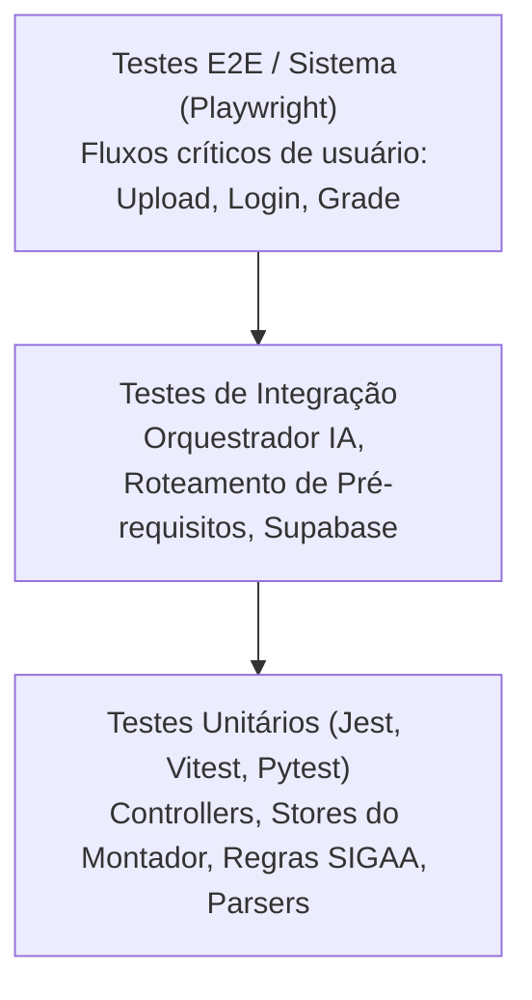

# Cobertura e Arquitetura de Testes — NoFluxoUNB

Este documento fornece um panorama abrangente da engenharia de testes do projeto **NoFluxoUNB**, detalhando as suítes em cada camada da aplicação, critérios de aceitação, portões de qualidade e métodos de execução.

---

## 🏛️ A Pirâmide de Testes no NoFluxoUNB

O projeto organiza seus testes de acordo com a clássica pirâmide de testes de software:



| Nível | Camada | Ferramenta | Quantidade de Arquivos | Foco Principal |
|---|---|---|---|---|
| **Unidade** | Frontend (`no_fluxo_frontend_svelte`) | Vitest | 42 arquivos | Lojas de grade (`grade.store.*`), regras de pré-requisito (`grade-pool.*`), conversão de horários e regras UnB |
| **Unidade** | Backend (`no_fluxo_backend`) | Jest / ts-jest | 25 arquivos | Controllers de matérias/fluxograma, Motor 2 de planejamento, persistência de sessão e orquestrador |
| **Unidade** | Scraping e Dados (`tests-python`) | Pytest | 3 arquivos | Parser de expressões lógicas e scraping de turmas |
| **Unidade** | Parse PDF (`no_fluxo_backend/parse-pdf`) | Pytest | 2 arquivos | Extração de texto e estruturação de históricos |
| **Unidade** | IA Agent (`mcp_agent`) | Pytest | 1 arquivo | Validação de tool calls do assistente |
| **Sistema / E2E** | Frontend (`no_fluxo_frontend_svelte`) | Playwright | 3 arquivos | Upload de histórico escolar, autenticação e viewport mobile |

---

## 🧭 Mapa de Documentação de Testes

Consulte os guias especializados para cada subsistema do projeto:

- [**Estratégia de Testes**](estrategia-de-testes.md): Técnicas de projeto (caixa-preta, caixa-branca, MC/DC, mocks) e plano de evolução.
- [**Testes do Backend (Jest)**](testes-backend.md): Catálogo detalhado das 25 suítes de testes em TypeScript, isolamento de controllers e regras do Motor 2.
- [**Testes do Frontend (Vitest & Playwright)**](testes-frontend.md): Catálogo das suítes de componentes, stores reativas de montagem de grade e testes end-to-end.
- [**Testes em Python (Pytest)**](testes-python.md): Suítes de ingestão de dados, análise de expressões booleanas e ferramentas de IA.
- [**Pipeline de Integração Contínua (CI)**](pipeline-ci.md): Automação no GitHub Actions, execução paralela e regras de merge.
- [**Métricas e Cobertura de Código**](cobertura-metricas.md): Como medir a cobertura, thresholds aceitáveis e integração com Codecov.

---

## ⚡ Comandos Rápidos de Execução

### Executar Todas as Suítes Localmente

```bash
# Na raiz do repositório (Linux/macOS ou Git Bash):
./run_all_tests.sh
```

### Executar por Camada

```bash
# 1. Testes do Backend (TypeScript):
cd no_fluxo_backend
npm test                  # Execução padrão
npm run test:coverage     # Relatório de cobertura

# 2. Testes do Frontend (SvelteKit):
cd no_fluxo_frontend_svelte
pnpm run test:unit        # Vitest
pnpm run test:coverage    # Cobertura Vitest
npx playwright test       # Testes E2E (requer dev server)

# 3. Testes em Python:
cd tests-python
python -m pytest -v
```

---

## 🎯 Matriz de Rastreabilidade e Critérios

| Domínio de Negócio | Módulos de Produção | Suítes de Teste Associadas |
|---|---|---|
| **Fluxograma e Matrizes** | `FluxogramaController.ts`, `materias_controller.ts` | `fluxograma_controller.test.ts`, `materias_controller.test.ts`, `curriculum-graph.test.ts` |
| **Montador de Grade** | `grade.store.svelte.ts`, `grade-pool.service.ts` | 11 testes `grade.store.*.test.ts`, 6 testes `grade-pool.*.test.ts` |
| **Expressões de Pré-requisito** | `expressao_parser.py`, `expressao-logica.ts` | `test_expressao_parser.py`, `expressao-logica.test.ts`, `planejamento-corequisitos.test.ts` |
| **Assistente e Motor de IA** | `AssistenteController.ts`, `api_producao.py` | `planejador-agente.test.ts`, `orquestrador-fase2.test.ts`, `revisor-fase3.test.ts`, `test_tool_call_utils.py` |
| **Autenticação e Sessão** | `authGuard.ts`, `users_controller.ts` | `authGuard.test.ts`, `users_controller.test.ts`, `session-persistence.test.ts`, `login-auth.exploratorio.spec.ts` |
| **Extração de Histórico** | `pdf_parser_final.py`, `pdf_parser_ocr.py` | `test_parser.py`, `test_exploratorio_kauan.py`, `upload-historico.exploratorio.spec.ts` |
