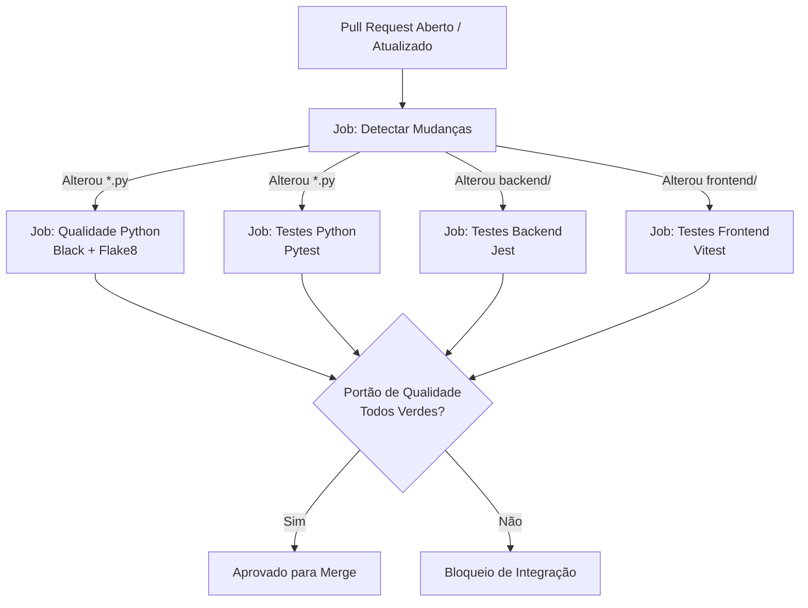

# Pipeline de Integração Contínua (CI)

O pipeline de Integração Contínua do **NoFluxoUNB** atua como o principal guardião de qualidade da base de código, garantindo que todas as suítes de teste e verificações estáticas sejam executadas a cada **Pull Request** e em pushes para as branches `main` e `dev`.

---

## ⚙️ Arquitetura do Pipeline

O workflow está configurado no arquivo [`.github/workflows/pipelineCI.yml`](https://github.com/unb-mds/2025-1-NoFluxoUNB/blob/main/.github/workflows/pipelineCI.yml).

### Estratégia de Concorrência e Economia de Recursos
- **Cancelamento em Progresso:** A diretiva `concurrency: cancel-in-progress: true` descarta automaticamente execuções anteriores no mesmo PR se novos commits forem enviados, poupando minutos de execução nos runners do GitHub Actions.
- **Detecção Inteligente de Mudanças (`paths-filter`):** O job inicial `changes` inspeciona os arquivos modificados. Se um PR alterar apenas código do frontend, os jobs de backend e python são ignorados naquele run, reduzindo o tempo de validação para menos de 2 minutos.



---

## 📋 Jobs do Pipeline

| Job | Escopo | Ferramentas | Pré-requisitos de Sistema |
|---|---|---|---|
| `changes` | Otimização | `dorny/paths-filter@v3` | Nenhum |
| `qualidade-python` | Estilo e Sintaxe Python | Black `25.11.0`, Flake8 `7.3.0` | Python 3.11 |
| `testes-python` | Dados, Parser e OCR | Pytest, Pytest-cov | `tesseract-ocr`, `poppler-utils` |
| `testes-backend` | API REST e Motor 2 | Jest, ts-jest | Node.js 20, npm ci |
| `testes-frontend` | SvelteKit e Montador | Vitest | Node.js 20, npm ci |

---

## 🔒 Variáveis de Ambiente Sintéticas no CI

Alguns módulos (como os clientes do Supabase no frontend e backend) inicializam conexões no momento de importação de módulos. No ambiente do GitHub Actions não existem arquivos `.env` versionados por questões de segurança.

Para permitir a execução hermética dos testes de unidade sem chamadas reais à rede, o pipeline injeta credenciais sintéticas:

```yaml
env:
  PUBLIC_SUPABASE_URL: https://example.supabase.co
  PUBLIC_SUPABASE_ANON_KEY: ci-fake-anon-key
  PUBLIC_API_URL: http://localhost:3000
  PUBLIC_REDIRECT_URL: http://localhost:5173
```

Nenhum teste de unidade efetua tráfego externo para esses endpoints sintéticos.

---

## 🚦 Critérios para Aprovação de Pull Request

Para que um PR seja considerado elegível para merge na branch principal:

1. **Todos os jobs disparados devem concluir com status verde.**
2. **Ausência de regressões:** Nenhuma suíte previamente aprovada pode quebrar.
3. **Formatação impecável:** O Black não deve detectar divergências de indentação ou espaçamento.
4. **Sem erros de linter:** O Flake8 e ESLint devem passar com zero avisos impeditivos.
